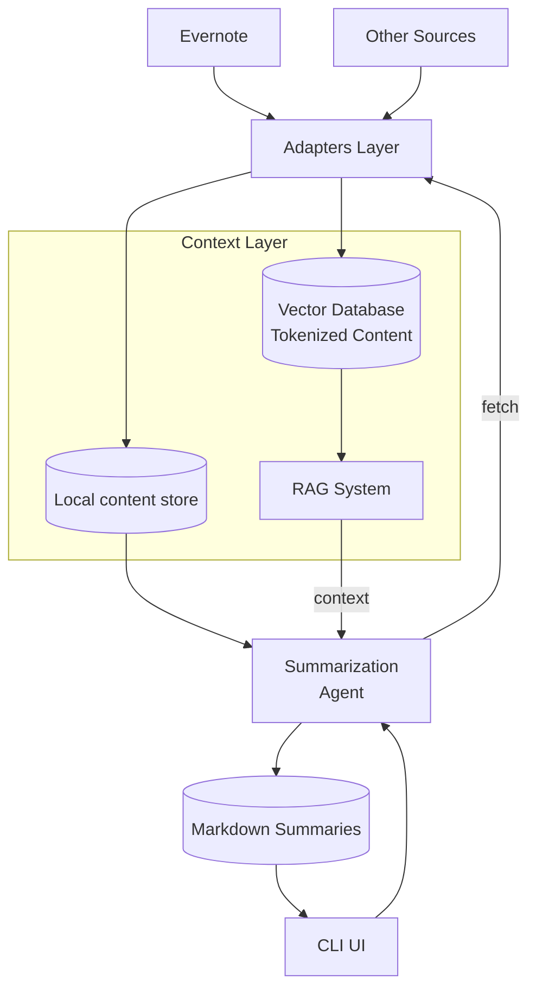
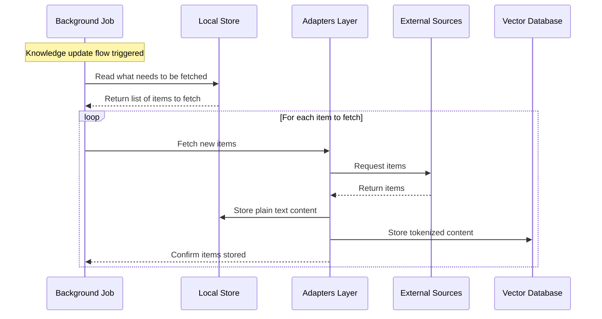
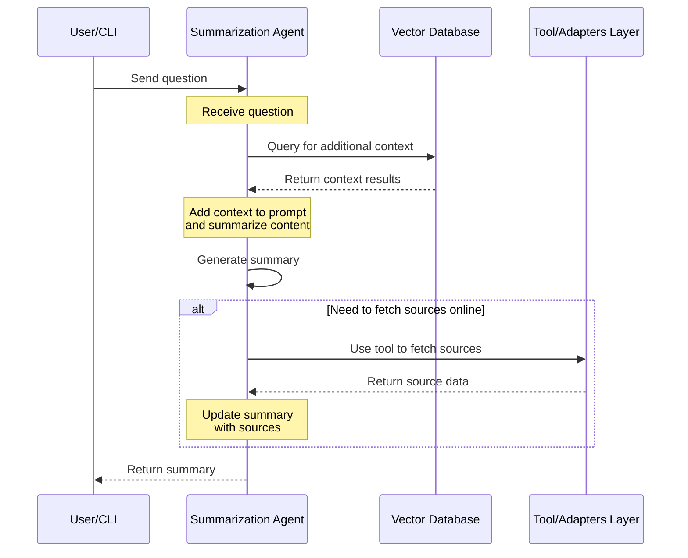

# Architecture Documentation

Assistant is an AI agent that organizes your knowledge and summarizes topics.

- Assistant consumes your notes in a variety of formats from a variety of sources.
  From here it uses an LLM to produce summaries of specific topics and store them
  locally to be consulted later.
- The user interacts with Assistant through a CLI ui for now where the user can
  ask for the summary for a specific topic.
- Assistant is able to find references onnline for the content of a specific
  statement in the summary. Sometime the reference are parts of the original
  content.
- Summaries are stored locally in markdown format to be consulted and updated later on.

## High level components

These are the logical components involved in the system at the highest level.

- User's knowledge is fetched from a variety of external systems. These are plugins
  which provide a unified interface in the [Adapters Layer](./adapters.md).
- We store documents fetched online in both plain text and a Vector DB: [Context Layer](./context.md).
  The Vector DB is used for the RAG pipeline to provide context to the agent.
  The `Local content store` contains the downloaded content together with metadata
  in order not to download all content each time.
- The [Summarization Agent](./summarization.md) is provide with context and messages, the agent can
  fetch online data via a tool that uses the [Adapters Layer](./adapters.md)
- Summaries are presented to the user who can decide whether to store them.
- Existing summaries can also be replaced. We keep versions

## Main workflows

This section describes how the components above interact.

### Knowledge update flow

The Adapters Layer provides a common interface and a common data model to retrieve
knowledge from external sources.

- A background job triggers the knowledge update flow.
- The job reads the local store to know what we need to fetch
- Then it fetches new items.

### Agent loop

The agent follows a standard RAG flow.

- it receives the question
- it runs the query for additional context on the Vector DB
- it adds the response to the prompt and summarizes the content
- it uses a tool to fetch sources online

## General architectural principles

There are some cross-cutting concerns in the design of the application.

### Storage and databases

- Our main storage is Postgres with pgvector installed.
- The entire data model is in a single schema calles `assitant`
- The application accesses Postgres with SQLAlchemy.
- Models are defined in the `assistant/moduels` module
- We have use Docker Compose to set up the external systems. We use it to start postgres.

### Configuration management

- The application configuration is defined by a yaml config file.
- Secrets are provided as environment variable or with the `.env` file.

### Logging and error management

- We use the logging package to log information. Standard level is INFO
- Each model defines some specific exceptions
