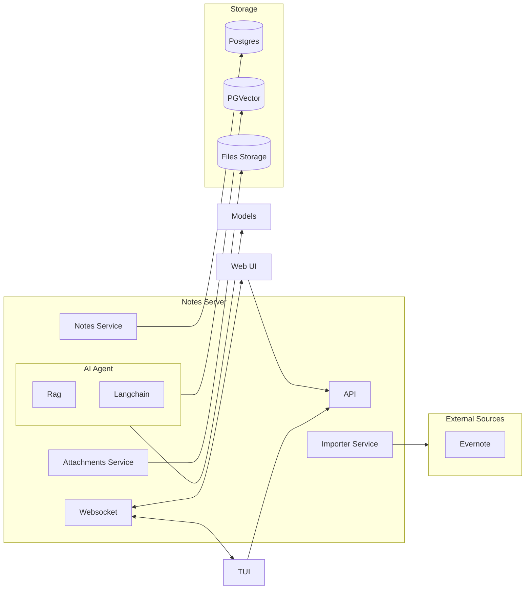
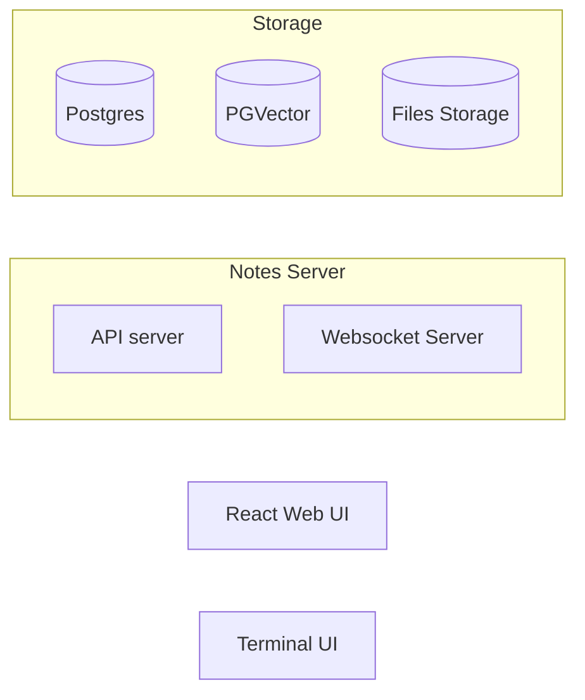

# Architecture Documentation

Assistant is a smart shared note taking system. It is meant to allow
people to organize their knowledge in notes and notebooks like Evernote.
It also includes an AI agent to search, manage and summarize the knowledge
in a semantic way.

- Notes are rich text stored as Markdown and can contain attachments
  and artifacts.

- Notes are organized in notebooks.

- Notes and notebooks can be shared between users who can update them concurrently.
  Conflicts are solved by the system.

- The system has an api, a TUI, and a web UI interface. The web UI works
  on browser and mobile.

- The system contains a RAG pipeline to organize the knowledge for agents.
  It also includes a chat UI with the agent to search and explore the
  content of the notes.

- The agent searches also in the attachments.

## Main Architecture Components

This describes how the components work with each other.

The main logical component is the `Notes Server`. This runs the entire business logic.
At this level the server has two interfaces: the `api` and the `websocket server`
that can be deployed independently.

The `Notes Server` contains three main components:

- The `Notes Service`. This manages the notes and the notebooks. It provides
  the functionalities to interact with notes: creation and management of
  notes and notebooks; all edit operations; the structure of the notes;
  the reconciliation logic for concurrent access.

- The `Attachment Service`. This manages the attachment storage. It is the
  component we interact with to upload and retrieve attachments.

- The `AI Agent` implements all the AI powered features: the RAG pipeline;
  the interaction with agents; the chat backend; the search system.

The `API` and `Websocket` components are the two ways to interact with the
system for clients. `API` is a FastAPI rest api the client use to manage pull based
interactions like login, user creation, sharing, CRUD on notes.
`Websocket` manages most of the push based interactions: note edits and updates;
chat; etc.

We run three storage systems, two of which are colocated:

- A file storage for attachments. Locally this is the file system, in the cloud
  this is an object store

- Postgres with pgVector installed. This runs the overall data model.

We can import notes from external systems via the `Importer` which talks to
external system.

## Deployment system

This is how the components above are packaged and deployed:

The `Notes Server` is a python package that contains two CLI scripts:

- One runs the API Server.

- One runs the Websocket Server.

These are in the same python package but can be deployed independently.
They are provided as a docker container as well.

The TUI is a python package. It is separate from the main package in the
same github repo.

The Web UI is a React single-page application in the `/frontend`
directory. It is built with Vite, React, TypeScript, React Router, and
TanStack Query. It talks to the API server over HTTP and uses the
`X-User-Id` header for user identification. The source lives in
`frontend/src/` with API client, components, and routing.

Both the TUI and the Web UI talk to the API and Websocket server.

All this can be deployed in a Docker Compose bundle that contains:
- One container that runs API server and Websocket server
- One container for Postgres

The API server also runs the web server that is the entrypoint for
the webui.

## Subcomponents

- [`Notes Service`](notesservice.md)
- [`API`](api.md)
- [`Markdown support`](markdown.md)
- [`Web frontend`](frontend.md)
