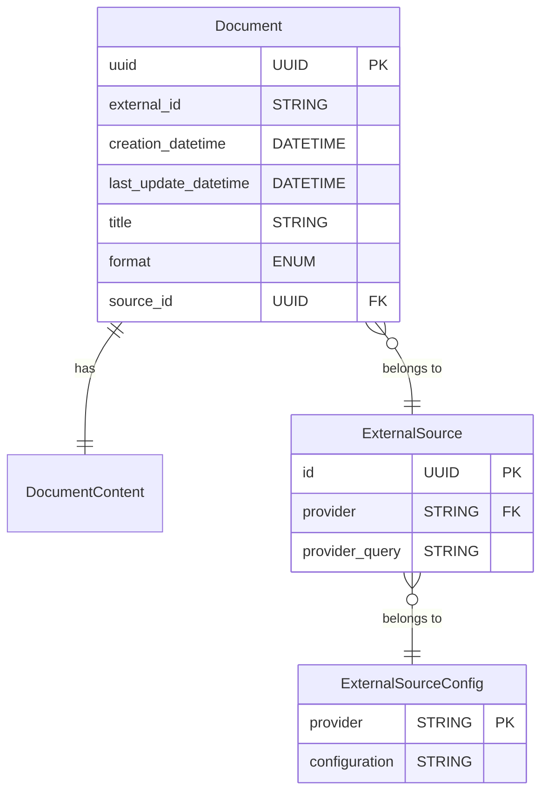

# Adapters Layer

The Adapters Layer provides a standard interface and data model over documents
and notes that contains user's knowledge

## Data model

The central element of the `Document` entity. This represent self contained
piece of content from an external source. It contains

- uuid (generated by our system)
- extenral id (the id of the same piece of content in the external source)
- creation datetime
- last update datetime
- title (from the extenral source)
- format (it can be text, markdown, PDF)
- source id

The second entity is the `Document Content` which contains the bytes of the
document

The `ExternalSource` entity identifies the plugin that we us to load extenral
content and its configuration. Each ExternalSource has a provider, which
identifies the system (like evernote). It also has source specific query
parameters.

As an example we could have multiple evernote integraitons configured for different
notebooks with different query parameters. The plugin is the same. Each `ExternalSource`
instance only specify query parameters for the specific integration. It does
not override the config parameters in `ExternalSourceConfig`.

- `DocumentContent` has no fileds specified here as it is not an entity stored in the
  database. It represents the file system.
- The `Document` and `ExternalSource` entities is going to be stored in a Postgres database.
- The DocumentContent will be stored in the file system.
  be stored in one file. The name will be the UUID.
- The `ExternalSourceConfig` configuraiton parameters will be in a yaml config file
  rather than in the DB. The `ExternalSource`

## External Source interface

Each external source will be defined by a plugin that will extend the `ExternalSource`
class. The `ExternalSource` class defines the common interface.

The `ExternalSource` interface has these methods:

- `get_document`. This takes the external id of a document and fetches the content.
- `list_documents`. This takes the datetime of the earliest document to fetch and the
returns the list of the document ids. Source-specific query parameters are bound to the
configured `ExternalSource` instance (loaded from the DB), not passed at call time. The
datetime should fitler documents by update date and not creation date.

There is a `Registry` class that maps provider ids to their implementation. This
maps provider **types** (e.g. `evernote`) to their implementation class, and returns
cached **instances** keyed by the configured external source **instance id**
(`ExternalSource.id`).

When resolving an instance, the `Registry`:

- reads provider-type configuration from `config.yaml` under `external_sources.<provider>`
- reads source-instance query parameters from the DB `ExternalSource.provider_query`
- instantiates the plugin once and reuses it for subsequent calls

## The DataLoad job.

The `DataLoad` job is a module with a function that iterates through the `ExternalSource`
classes, Identifies the most recent document we have in the `Document` table,
fetches the new documents with the `ExternalSource` plugin, add them to the DB.

It replaces the documents that have been updated.

TODO: Part of this flow will include storing embeddings in a Vector DB. This
is not yet part of the design and can be ignored for now.

At the end of the job, the system verifies if any document has been removed from the source.
If a document is deleted, it is removed from the database and the content is removed as well.

A CLI script is also added to trigger this flow.

## Infrastructure

- This is a simple python module. No frameworks to run it. We will run it in a
  Flask web application but this hsould not depend on Flask
- We use a postgres database. We run it locally in a container.
- We use SQLAlchemy https://pypi.org/project/SQLAlchemy/ as an ORM to deal with the database.

## Code

- The Adapter Layer is contained in a module called `adapters` inside the `assistant` package.
- A `plugin` submodules contains the implementations, while the interace is inside the `adapters` module.
- This is not the only module using postgres. All the SQLAlchemy models and postgres
  connection code is in a `models` module, directly in `assistant` package.
