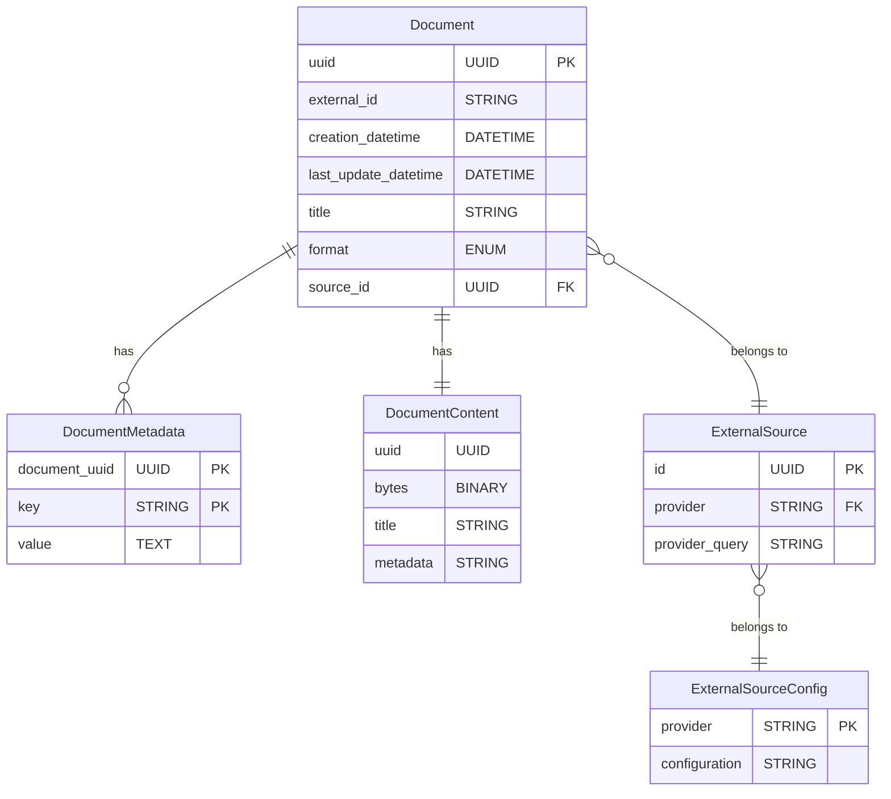

# Adapters Layer

The Adapters Layer provides a standard interface and data model over documents
and notes that contain the user's knowledge.

## Data model

The central element is the `Document` entity: a self-contained piece of content
from an external source. It has:

- **uuid** (generated by our system)
- **external_id** (the id of the same piece of content in the external source)
- **creation_datetime**
- **last_update_datetime**
- **title** (from the external source)
- **format** (text, markdown, or PDF)
- **source_id** (foreign key to the external source)

Documents can have optional **metadata** stored in the `document_metadata` table:
key-value pairs (e.g. notebook name, tags) that are loaded from the provider and
used when building embeddings. The `Document` model exposes them via
`metadata_entries` and helpers such as `set_metadata` and `metadata_dict`.

**DocumentContent** is an in-memory representation used when fetching or writing
content. It holds:

- **uuid** (document identifier; used as the filename on disk)
- **bytes** (raw content)
- **title** (from the provider; may be empty)
- **metadata** (key-value mapping from the provider, e.g. notebook name)

On the **filesystem**, only the raw bytes are stored, in a file named by the
document UUID. Title and metadata are not stored in the content file; they are
persisted in the database (`Document.title` and `document_metadata` rows).

The **ExternalSource** entity identifies the plugin used to load external
content and its configuration. Each ExternalSource has a **provider** (e.g.
evernote) and source-specific **provider_query** parameters. Multiple
integrations of the same provider (e.g. different Evernote notebooks) can be
configured as separate ExternalSource rows with different query parameters. The
plugin class is the same; each instance only carries the query parameters for
that integration. Provider-level settings live in config (e.g.
`external_sources.<provider>`), not in the DB.

- **Document**, **ExternalSource**, and **DocumentMetadata** are stored in
  Postgres (schema `assistant`). DocumentMetadata rows are keyed by
  (document_uuid, key).
- **DocumentContent** is not a table: it is the in-memory shape used when
  reading/writing content. On disk, only the content bytes are stored, in a file
  named by the document UUID under the configured document storage path. Title
  and metadata for a document live in the DB (Document.title and
  document_metadata).
- **ExternalSourceConfig** (provider-level configuration) is read from the YAML
  config file, not from the database.

## External Source interface

Each external source will be defined by a plugin that will extend the `ExternalSource`
class. The `ExternalSource` class defines the common interface.

The `ExternalSource` interface has these methods:

- `get_document`. This takes the external id of a document and fetches the content.
- `list_documents`. This takes the datetime of the earliest document to fetch and the
returns the list of the document ids. Source-specific query parameters are bound to the
configured `ExternalSource` instance (loaded from the DB), not passed at call time. The
datetime should filter documents by update date and not creation date.

There is a `Registry` class that maps provider ids to their implementation. This
maps provider **types** (e.g. `evernote`) to their implementation class, and returns
cached **instances** keyed by the configured external source **instance id**
(`ExternalSource.id`).

When resolving an instance, the `Registry`:

- reads provider-type configuration from `config.yaml` under `external_sources.<provider>`
- reads source-instance query parameters from the DB `ExternalSource.provider_query`
- instantiates the plugin once and reuses it for subsequent calls

## The DataLoad job.

The `DataLoad` job is a module with a function that iterates through the `ExternalSource`
classes, Identifies the most recent document we have in the `Document` table,
fetches the new documents with the `ExternalSource` plugin, add them to the DB.

It replaces the documents that have been updated.

TODO: Part of this flow will include storing embeddings in a Vector DB. This
is not yet part of the design and can be ignored for now.

At the end of the job, the system verifies if any document has been removed from the source.
If a document is deleted, it is removed from the database and the content is removed as well.

A CLI script is also added to trigger this flow.

## Infrastructure

- This is a simple python module. No frameworks to run it. We will run it in a
  Flask web application but this should not depend on Flask
- We use a postgres database. We run it locally in a container.
- We use SQLAlchemy https://pypi.org/project/SQLAlchemy/ as an ORM to deal with the database.

## Code

- The Adapter Layer is contained in a module called `adapters` inside the `assistant` package.
- A `plugin` submodules contains the implementations, while the interface is inside the `adapters` module.
- This is not the only module using postgres. All the SQLAlchemy models and postgres
  connection code is in a `models` module, directly in `assistant` package.
