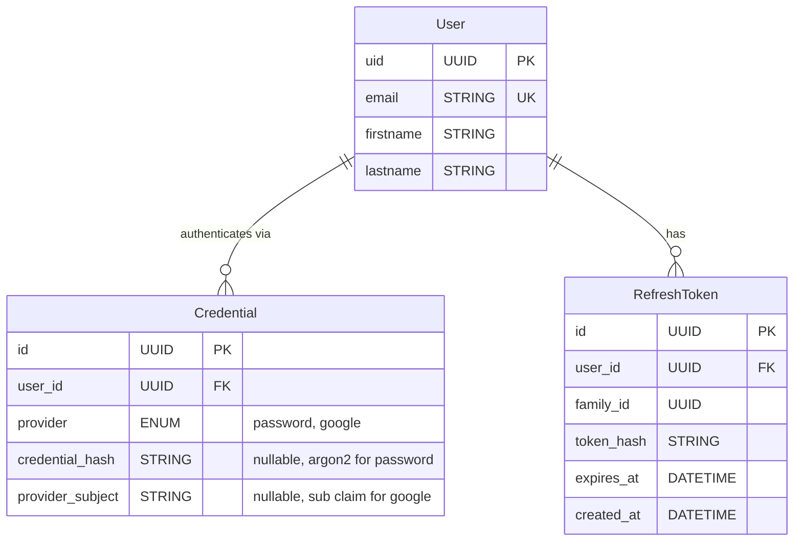

# Authentication

## Overview

The system supports two authentication modes and two identity providers.
Authentication is based on JWT access tokens and refresh tokens. The
access token is stateless — the server does not check it against the DB
on every request. Revocation relies on token expiration.

## Authentication Modes

A request must use exactly one of these modes. If both are present, the
server rejects the request with 401.

### Cookie Mode (Web UI)

For browser-based sessions. The access token and refresh token are
delivered as `HttpOnly`, `Secure`, `SameSite=Lax` cookies. The frontend
communicates with the API through a Vite dev-server proxy in development
so that cookies are same-origin. In production the API server serves the
frontend, so cookies remain same-origin.

### Bearer Token Mode (Mobile / Native Clients)

For mobile apps and native clients. Tokens are returned in the response
body and sent via `Authorization: Bearer <token>` header. No third-party
integrations for now.

## Token Design

### Access Token (JWT)

- **Lifetime:** 15 minutes
- **Format:** Signed JWT
- **Claims:** `sub` (user UUID), `exp`, `iat`
- **Validation:** Stateless — signature and expiry check only. No DB
  round-trip per request.

### Refresh Token

- **Lifetime:** 7 days
- **Storage:** Stored in the database with a `family_id` column to
  support rotation and replay detection.
- **Rotation:** Every use of a refresh token issues a new refresh token
  and invalidates the old one. If a previously used refresh token is
  replayed, the entire token family is invalidated (all refresh tokens
  with the same `family_id` are deleted).

### Revocation

Revocation is handled by deleting refresh tokens from the database.
Because access tokens are stateless and not checked against a blocklist,
a revoked user retains access until their current access token expires
(up to 15 minutes).

- **Logout:** Deletes the refresh token family server-side. Client
  clears local tokens/cookies.
- **Compromise:** Delete all refresh tokens for the user. Exposure
  window is bounded by the access token lifetime.

## Identity Providers

### Username and Password

Identities are stored in the database. Passwords are hashed with
**Argon2**. Authentication is a lookup by `(email, provider='password')`
joining the user and credentials tables.

### Google OAuth2

> **Not yet implemented.** Design details to be finalized when this is
> built.

Authentication via Google OAuth2. Lookup is by
`(provider='google', provider_subject=<google sub claim>)`.

## Provider Linking

A user's email is unique across the system. When a user authenticates
with a new provider whose email matches an existing account, the system
requires verification through the existing provider before linking.

**Example:** A user has a password account. They click "Log in with
Google" and the Google account has the same email. The system prompts
them to enter their existing password. Only after successful
verification is the Google credential linked to the account.

This prevents account takeover via unverified provider linking.

Once linked, the previous credential is replaced — for example, linking
Google to a password account disables password login for that user.

## Data Model



**Unique constraints:**
- `Credential(user_id, provider)` — one credential per provider per user
- `Credential(provider, provider_subject)` — prevents two users from
  linking the same external account
- `RefreshToken(token_hash)` — for lookup on refresh

The `User` table remains a profile table. Authentication concerns are
isolated in `Credential` and `RefreshToken`.

## API Endpoints

### Registration and Login

`POST /auth/register`

Creates a user and a password credential.

Request body:
```json
{
    "email": "user@example.com",
    "password": "secret",
    "firstname": "Jane",
    "lastname": "Doe"
}
```

Response (201): User profile (no tokens — client must log in).

`POST /auth/login`

Authenticates with email and password. Returns tokens via cookies or
response body depending on the client mode.

Request body:
```json
{
    "email": "user@example.com",
    "password": "secret"
}
```

Response (200): Access token and refresh token. Delivery mechanism
depends on the auth mode (cookie or bearer).

### Token Management

`POST /auth/refresh`

Exchanges a refresh token for a new access token and a rotated refresh
token. The old refresh token is invalidated. Replay of a consumed
refresh token invalidates the entire family.

`POST /auth/logout`

Invalidates the refresh token family. Client clears local state.

### Google OAuth2 (future)

`GET /auth/google` — Initiates the OAuth2 flow.

`POST /auth/google/callback` — Completes the OAuth2 flow.

### Provider Linking

`POST /auth/link`

Links a new authentication provider to an existing account. Requires
proof of ownership via the current provider (e.g., password
verification) before linking.

## Middleware

A single FastAPI dependency resolves the current user from the request:

1. Check for `Authorization: Bearer` header and for auth cookie.
2. If both are present, reject with 401.
3. If neither is present, reject with 401.
4. Validate the JWT (signature, expiry).
5. Extract `sub` claim as the user ID.

This dependency replaces the current `X-User-Id` header mechanism. The
cutover is a hard switch — no backward compatibility period.

## Websocket Authentication

The websocket server authenticates on the HTTP upgrade handshake only.
The cookie or bearer token is validated during the upgrade. Once the
connection is established, no further token checks occur per message.

Token expiry during an active websocket connection does not terminate
the connection. The client must re-authenticate on reconnect.

## Frontend Integration

The frontend uses cookie mode. The Vite dev server proxies API requests
so that cookies are same-origin in development. In production, the API
server serves the frontend static files.

The existing `X-User-Id` header in `apiFetch()` is removed. The browser
sends cookies automatically — no frontend token management needed for
the web UI.

The `UserProvider` context is updated to fetch the current user from an
authenticated endpoint (e.g., `GET /auth/me`) instead of using a
hardcoded user ID.
