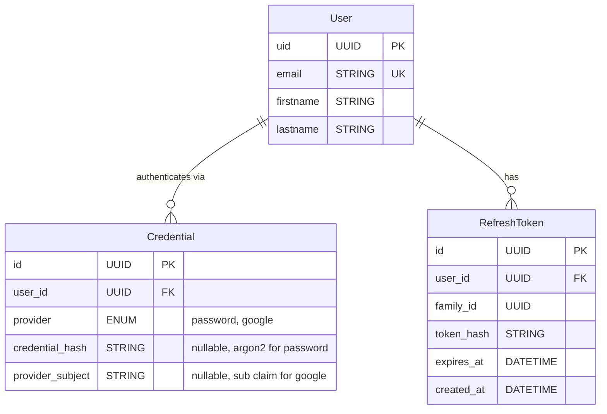

# Authentication

## Overview

The system supports two authentication modes and two identity providers.
Authentication is based on JWT access tokens and refresh tokens. The
access token is stateless — the server does not check it against the DB
on every request. Revocation relies on token expiration.

## Authentication Modes

A request must use exactly one of these modes. If both are present, the
server rejects the request with 401.

### Cookie Mode (Web UI)

For browser-based sessions. The access token and refresh token are
delivered as `HttpOnly`, `Secure`, `SameSite=Lax` cookies. The frontend
communicates with the API through a Vite dev-server proxy in development
so that cookies are same-origin. In production the API server serves the
frontend, so cookies remain same-origin.

### Bearer Token Mode (Mobile / Native Clients)

For mobile apps and native clients. Tokens are returned in the response
body and sent via `Authorization: Bearer <token>` header. No third-party
integrations for now.

## Token Design

### Access Token (JWT)

- **Lifetime:** 5 minutes
- **Format:** Signed JWT
- **Claims:** `sub` (user UUID), `exp`, `iat`
- **Validation:** Stateless — signature and expiry check only. No DB
  round-trip per request.

### Refresh Token

- **Lifetime:** 7 days
- **Storage:** Stored in the database with a `family_id` column to
  support rotation and replay detection.
- **Rotation:** Every use of a refresh token issues a new refresh token
  and invalidates the old one. If a previously used refresh token is
  replayed, the entire token family is invalidated (all refresh tokens
  with the same `family_id` are deleted).

### Revocation

Revocation is handled by deleting refresh tokens from the database.
Because access tokens are stateless and not checked against a blocklist,
a revoked user retains access until their current access token expires
(up to 15 minutes).

- **Logout:** Deletes the refresh token family server-side. Client
  clears local tokens/cookies.
- **Compromise:** Delete all refresh tokens for the user. Exposure
  window is bounded by the access token lifetime.

## Identity Providers

### Username and Password

Identities are stored in the database. Passwords are hashed with
**Argon2**. Authentication is a lookup by `(email, provider='password')`
joining the user and credentials tables.

### Google OAuth2

Authentication via Google's [OpenID Connect
flow](https://developers.google.com/identity/openid-connect/openid-connect#authenticatingtheuser)
(authorization-code grant, backend-side code exchange, ID-token
validation). Cookie/web mode only — there is no bearer/native path for
Google sign-in.

A returning user is looked up by
`(provider='google', provider_subject=<google sub claim>)` — never by
email, since email isn't guaranteed stable. An unrecognized Google
identity is auto-provisioned: there's no separate login-vs-register UX,
one button drives both. Provisioning still goes through the same
registration gate as password registration
(`invites.service.resolve_registration_gate`) — `registration_enabled`
and invite validity are enforced identically.

Google's `email_verified` claim is checked at auth time and the attempt
is rejected outright if false; the claim is never persisted (there is no
email-confirmation flow in this system to key off of). Missing
`given_name`/`family_name` claims fall back to an empty string rather
than blocking account creation.

The `state` OAuth param carries the flow's CSRF nonce and (for the
invite-acceptance path) which invite is being redeemed — signed with the
same HS256 secret as access tokens, since this backend keeps no
server-side session to stash that data in otherwise.

See `Provider collisions` below for what happens when the Google email
already belongs to a different provider.

## Provider collisions

There is no cross-provider account linking today. Each user has exactly
one authentication mechanism. If a Google sign-in's email already
belongs to a *different* provider's credential (a password account,
currently the only other kind), the attempt is rejected with an
actionable error rather than silently linking or overwriting anything.

A "switch/link mechanism" (e.g. verify your password, then attach a
Google identity to the same account) is deliberately out of scope here
and left as future work.

## Data Model


```mermaid
erDiagram
    User ||--o{ Credential : "authenticates via"
    User ||--o{ RefreshToken : "has"

    User {
        uid UUID PK
        email STRING UK
        firstname STRING
        lastname STRING
    }

    Credential {
        id UUID PK
        user_id UUID FK
        provider ENUM "password, google"
        credential_hash STRING "nullable, argon2 for password"
        provider_subject STRING "nullable, sub claim for google"
    }

    RefreshToken {
        id UUID PK
        user_id UUID FK
        family_id UUID
        token_hash STRING
        expires_at DATETIME
        created_at DATETIME
    }
```

**Unique constraints:**
- `Credential(user_id, provider)` — one credential per provider per user
- `Credential(provider, provider_subject)` — prevents two users from
  linking the same external account
- `RefreshToken(token_hash)` — for lookup on refresh

The `User` table remains a profile table. Authentication concerns are
isolated in `Credential` and `RefreshToken`.

## API Endpoints

### Registration and Login

`POST /auth/register`

Creates a user and a password credential.

Request body:
```json
{
    "email": "user@example.com",
    "password": "secret",
    "firstname": "Jane",
    "lastname": "Doe"
}
```

Response (201): User profile (no tokens — client must log in).

`POST /auth/login`

Authenticates with email and password. Returns tokens via cookies or
response body depending on the client mode.

Request body:
```json
{
    "email": "user@example.com",
    "password": "secret"
}
```

Response (200): Access token and refresh token. Delivery mechanism
depends on the auth mode (cookie or bearer).

### Token Management

`POST /auth/refresh`

Exchanges a refresh token for a new access token and a rotated refresh
token. The old refresh token is invalidated. Replay of a consumed
refresh token invalidates the entire family.

`POST /auth/logout`

Invalidates the refresh token family. Client clears local state.

### Google OAuth2

`GET /auth/google` — Builds a signed `state` (CSRF nonce, plus the
invite id if `?invite_id=` was given) and redirects (302) the browser to
Google's consent screen (`prompt=select_account`, scopes `openid email
profile`).

`GET /auth/google/callback` — Google's own redirect target (a top-level
browser navigation with `code`/`state` query params, always a GET, never
something frontend JS reads a response body from). Exchanges the code,
verifies the ID token, then either logs the user in or auto-provisions
them per the registration gate. Every outcome — success or failure — is
itself a redirect: success sets the auth cookies and sends the browser
to `/notebooks`; failure sends it back to `/login` (or, for an
invite-flow attempt, to `/invite/:inviteId`) with a machine-readable
`?google_error=<code>` the frontend maps to a message. Neither route
ever returns JSON.

No `POST /auth/link` or other provider-linking endpoint exists — see
"Provider collisions" above.

## Middleware

A single FastAPI dependency resolves the current user from the request:

1. Check for `Authorization: Bearer` header and for auth cookie.
2. If both are present, reject with 401.
3. If neither is present, reject with 401.
4. Validate the JWT (signature, expiry).
5. Extract `sub` claim as the user ID.

This dependency replaces the current `X-User-Id` header mechanism. The
cutover is a hard switch — no backward compatibility period.

## Websocket Authentication

The websocket server authenticates on the HTTP upgrade handshake only.
The cookie or bearer token is validated during the upgrade. Once the
connection is established, no further token checks occur per message.

Token expiry during an active websocket connection does not terminate
the connection. The client must re-authenticate on reconnect.

## Frontend Integration

The frontend uses cookie mode. The Vite dev server proxies API requests
so that cookies are same-origin in development. In production, the API
server serves the frontend static files.

The existing `X-User-Id` header in `apiFetch()` is removed. The browser
sends cookies automatically — no frontend token management needed for
the web UI.

The `UserProvider` context is updated to fetch the current user from an
authenticated endpoint (e.g., `GET /auth/me`) instead of using a
hardcoded user ID.
