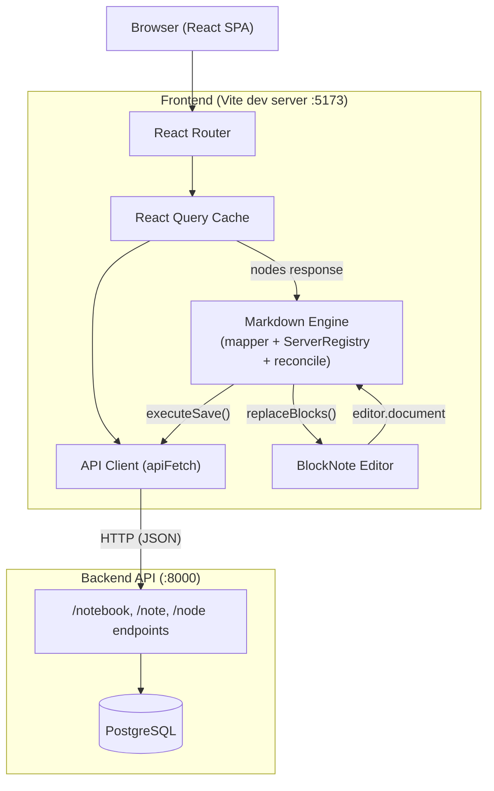
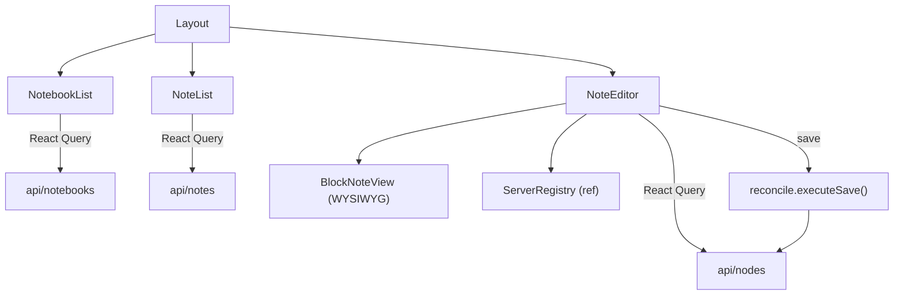

# Frontend Architecture

The frontend is a React single-page application that provides a notebook/note editing interface backed by the REST API. It is built with Vite, TypeScript, React Router, TanStack React Query, and **BlockNote** (WYSIWYG block editor).

## High-Level Overview



The frontend runs as a Node/Vite dev server on port 5173 and communicates with the Python backend API on port 8000 over HTTP/JSON. All server state is managed through React Query; there is no client-side persistence.

## Provider Hierarchy

The application mounts a nested provider stack in `main.tsx`:

```
StrictMode
  QueryClientProvider      -- React Query cache (refetchOnWindowFocus: false)
    BrowserRouter          -- React Router v7
      UserProvider         -- fetches current user, provides userId via context
        App                -- route definitions
```

## Routing

All routes render the same `Layout` component; URL params determine what content is visible:

| Route | Behavior |
|---|---|
| `/` | Redirects to `/notebooks` |
| `/notebooks` | Sidebar shows notebook list only |
| `/notebooks/:notebookId/notes` | Sidebar shows notebook list + note list |
| `/notebooks/:notebookId/notes/:noteId` | Sidebar + note editor in main area |

## Component Tree



### Layout

Top-level composition component (`components/Layout.tsx`). Reads `notebookId` and `noteId` from URL params and renders a two-panel layout:
- **Sidebar** (300px fixed): `NotebookList` always visible; `NoteList` shown when a notebook is selected.
- **Main area** (flex): `NoteEditor` when a note is selected; placeholder message otherwise.

### NotebookList

Lists the user's notebooks with create/delete support (`components/NotebookList.tsx`). Uses React Query to fetch and mutate notebooks. Clicking a notebook navigates to its notes route. The active notebook is highlighted based on the URL.

### NoteList

Lists notes within the selected notebook (`components/NoteList.tsx`). Same CRUD pattern as NotebookList. Returns `null` when no notebook is selected.

### NoteEditor

The main editing surface (`components/NoteEditor.tsx`). Uses BlockNote (`useCreateBlockNote`) to create a WYSIWYG block editor that replaces the old textarea. Key responsibilities:

1. **Load**: Fetches `NoteNode[]` from the server via React Query. Calls `buildBlocksFromNodes()` to convert server nodes into BlockNote blocks and populate `ServerRegistry`. Calls `editor.replaceBlocks()` to set the document, then snapshots the initial serialized state.
2. **Edit**: The `BlockNoteView` component provides a rich WYSIWYG editing experience with a built-in formatting toolbar (bold, italic, headings, lists, code, tables, text colors, etc.). Changes are tracked via `editor.onChange()` to set the dirty flag.
3. **Save**: Calls `executeSave()` to reconcile the current document against the server. Updates the snapshot on success. Handles 409 conflicts.

Holds a `ServerRegistry` and a block snapshot in refs that persist across renders.

## Markdown Engine

The `src/markdown/` module is the core data layer of the editor. Three files work together to bridge BlockNote's document model with the server's node-per-block API.

### ServerRegistry (`markdown/serverRegistry.ts`)

A side table that maps **BlockNote block IDs → server node state** (`nodeId`, `version`, `nodeType`). This is the block identity invariant: every BlockNote block that has a corresponding server node is registered here.

Key operations:
- `set(blockId, state)` — registers a block's server identity on load or after create.
- `get(blockId)` — looks up server state for a given block.
- `markDeleted(blockId)` — moves the block's server node ID to the deleted queue.
- `consumeDeletedIds()` — drains the deleted queue (used by the reconciler before DELETE calls).
- `updateVersion(blockId, version)` — updates the version after a successful PATCH.
- `clear()` — resets the registry on note change.

### Mapper (`markdown/mapper.ts`)

Converts `NoteNode[]` from the API into BlockNote blocks and populates the `ServerRegistry`.

- `buildBlocksFromNodes(nodes, editor, registry)` — for each server node, calls `editor.tryParseMarkdownToBlocks(node.payload)` to parse markdown into block(s). The first parsed block is the primary block and gets registered against the server node ID. If a node payload parses into multiple blocks, extra blocks are appended but are flagged for creation on the next save.
- `buildSnapshot(blocks, editor)` — serializes the current block array into a `Map<blockId, string>` used by the reconciler to detect content changes.

### Reconcile (`markdown/reconcile.ts`)

The sync engine that persists changes to the server. `executeSave()` runs these phases:

1. **Detect deleted blocks** — blocks present in the previous snapshot but absent from `editor.document` are marked deleted in the registry.
2. **Delete server nodes** — drains `registry.consumeDeletedIds()` and issues `DELETE` calls.
3. **Create / migrate / update blocks** — iterates `editor.document` in order:
   - New blocks (no registry entry): `CREATE` with `afterNodeId`/`beforeNodeId` positional hints.
   - Legacy `text` nodes: delete old node, re-create as `markdown`.
   - Changed blocks (registry entry exists, content differs from snapshot): `PATCH` with `expected_version`.
4. **Return new snapshot** — serialized state of the saved document, used as the baseline for the next save.

## API Layer

All API modules live in `src/api/` and use a shared `apiFetch()` wrapper (`api/client.ts`) that:
- Reads `VITE_API_BASE_URL` (defaults to `http://localhost:8000`)
- Sets `Content-Type: application/json` and `X-User-Id` headers as needed
- Throws `ApiError` (with HTTP status) on non-OK responses

Modules: `users.ts`, `notebooks.ts`, `notes.ts`, `nodes.ts`.

## Data Flow Summary

```
Load:  NoteNode[] --> buildBlocksFromNodes() --> editor.replaceBlocks() --> BlockNoteView
                  ↳ ServerRegistry populated   ↳ snapshot captured

Edit:  User types / formats --> BlockNote internal state --> editor.onChange → isDirty=true

Save:  executeSave() --> diff snapshot vs editor.document
                     --> DELETE/CREATE/PATCH API calls
                     --> registry updated, new snapshot returned
```
