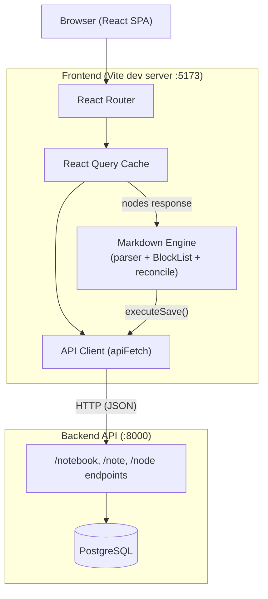
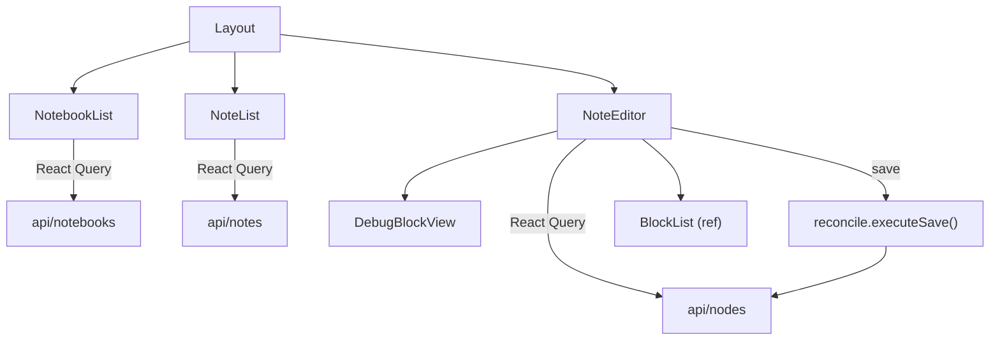

# Frontend Architecture

The frontend is a React single-page application that provides a notebook/note editing interface backed by the REST API. It is built with Vite, TypeScript, React Router, and TanStack React Query.

## High-Level Overview



The frontend runs as a Node/Vite dev server on port 5173 and communicates with the Python backend API on port 8000 over HTTP/JSON. All server state is managed through React Query; there is no client-side persistence.

## Provider Hierarchy

The application mounts a nested provider stack in `main.tsx`:

```
StrictMode
  QueryClientProvider      -- React Query cache (refetchOnWindowFocus: false)
    BrowserRouter          -- React Router v7
      UserProvider         -- fetches current user, provides userId via context
        App                -- route definitions
```

## Routing

All routes render the same `Layout` component; URL params determine what content is visible:

| Route | Behavior |
|---|---|
| `/` | Redirects to `/notebooks` |
| `/notebooks` | Sidebar shows notebook list only |
| `/notebooks/:notebookId/notes` | Sidebar shows notebook list + note list |
| `/notebooks/:notebookId/notes/:noteId` | Sidebar + note editor in main area |

## Component Tree



### Layout

Top-level composition component (`components/Layout.tsx`). Reads `notebookId` and `noteId` from URL params and renders a two-panel layout:
- **Sidebar** (300px fixed): `NotebookList` always visible; `NoteList` shown when a notebook is selected.
- **Main area** (flex): `NoteEditor` when a note is selected; placeholder message otherwise.

### NotebookList

Lists the user's notebooks with create/delete support (`components/NotebookList.tsx`). Uses React Query to fetch and mutate notebooks. Clicking a notebook navigates to its notes route. The active notebook is highlighted based on the URL.

### NoteList

Lists notes within the selected notebook (`components/NoteList.tsx`). Same CRUD pattern as NotebookList. Returns `null` when no notebook is selected.

### NoteEditor

The main editing surface (`components/NoteEditor.tsx`). This is the most complex component, connecting the textarea UI to the markdown block engine:

1. **Load**: Fetches `NoteNode[]` from the server, builds a `BlockList`, serializes to text for the textarea.
2. **Edit**: On each keystroke, identifies the current block by cursor position and applies the appropriate operation (update, split on double-newline, or merge when a separator is deleted).
3. **Save**: Calls `executeSave()` to reconcile dirty blocks with the server. Handles 409 conflicts.

Holds a `BlockList` instance in a ref that persists across renders.

### DebugBlockView

Optional side panel toggled from the editor toolbar (`components/DebugBlockView.tsx`). Renders a visual representation of the internal `BlockList` state showing block types, dirty/synced status, line positions, and the block under the cursor.

## Markdown Engine

The `src/markdown/` module is the core data layer of the editor. Three files work together to parse text into blocks, maintain them in a linked list, and sync changes to the server.

### Parser (`markdown/parser.ts`)

Converts raw markdown text into an array of `ParsedBlock` objects. Each block has a `blockType`, `content`, and `lineCount`.

- `classifyBlockType(content)` -- inspects the first line to determine the block type (heading, blockquote, list_item, image, code_block, or paragraph).
- `parseMarkdownBlocks(text)` -- splits text at block boundaries. Code blocks are delimited by triple-backtick fences. Headings and images are always single-line blocks. Other types consume consecutive non-blank lines until a type change or blank line.

### BlockList (`markdown/blockList.ts`)

A doubly-linked list of `BlockNode` objects that represents the in-memory document structure. Each node tracks:
- Content and block type
- Line position metadata (`lineStart`, `lineCount`)
- Server state (`nodeId`, `version`, `nodeType`) -- `null` for unsaved blocks
- A `dirty` flag set on any local modification

Key operations:
- `buildFromServerNodes(nodes)` -- constructs the list from API response. Handles both `markdown` nodes (1:1 mapping) and legacy `text` nodes (parsed into multiple blocks for migration).
- `insertAfter()` / `remove()` / `updateBlock()` -- structural mutations that mark blocks dirty and recompute line starts.
- `splitBlock()` / `mergeWithNext()` -- used by the editor when the user creates or removes block separators.
- `toText()` -- serializes the list back to a string (blocks joined by `\n\n`).

The list also maintains a `deletedNodeIds` array to track server nodes that need deletion on the next save.

### Reconcile (`markdown/reconcile.ts`)

The sync engine that persists local changes to the server. `executeSave()` runs four sequential phases:

1. **Delete removed blocks** -- deletes server nodes for blocks that were removed from the list.
2. **Migrate TEXT nodes** -- deletes legacy TEXT-type server nodes so they can be re-created as MARKDOWN nodes.
3. **Create new blocks** -- creates server nodes for blocks with no `serverState`, using positional hints (`afterNodeId`, `beforeNodeId`) to maintain ordering.
4. **Update dirty blocks** -- patches blocks that have server state but were modified locally. Uses optimistic concurrency control via `expected_version`.

## API Layer

All API modules live in `src/api/` and use a shared `apiFetch()` wrapper (`api/client.ts`) that:
- Reads `VITE_API_BASE_URL` (defaults to `http://localhost:8000`)
- Sets `Content-Type: application/json` and `X-User-Id` headers as needed
- Throws `ApiError` (with HTTP status) on non-OK responses

Modules: `users.ts`, `notebooks.ts`, `notes.ts`, `nodes.ts`.

## Data Flow Summary

```
Load:  Server nodes --> BlockList.buildFromServerNodes() --> BlockList.toText() --> textarea
Edit:  Keystroke --> handleTextChange() --> BlockList update/split/merge --> textarea
Save:  executeSave() --> DELETE/CREATE/PATCH API calls --> update serverState, clear dirty
```
