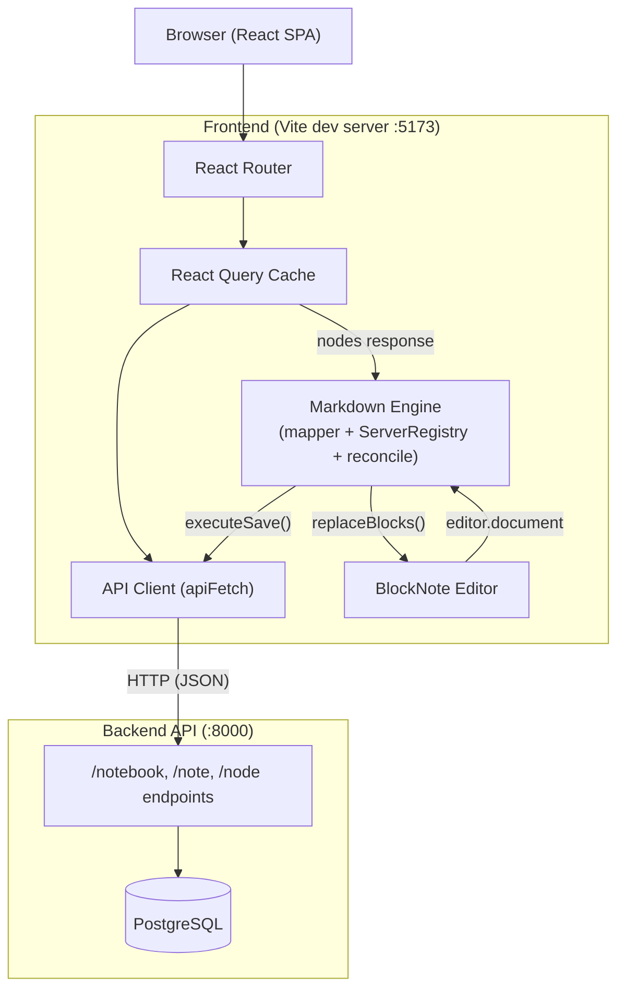
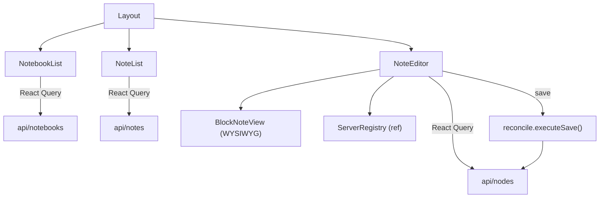

# Frontend Architecture

The frontend is a React single-page application that provides a notebook/note editing interface backed by the REST API. It is built with Vite, TypeScript, React Router, TanStack React Query, and **BlockNote** (WYSIWYG block editor).

## High-Level Overview


```mermaid
graph TB
    Browser["Browser (React SPA)"]

    subgraph Frontend["Frontend (Vite dev server :5173)"]
        Router["React Router"]
        RQ["React Query Cache"]
        API["API Client (apiFetch)"]
        BN["BlockNote Editor"]
        MD["Markdown Engine<br/>(mapper + ServerRegistry + reconcile)"]
    end

    subgraph Backend["Backend API (:8000)"]
        REST["/notebook, /note, /node endpoints"]
        DB[(PostgreSQL)]
    end

    Browser --> Router
    Router --> RQ
    RQ --> API
    API -- "HTTP (JSON)" --> REST
    REST --> DB

    BN -- "editor.document" --> MD
    MD -- "executeSave()" --> API
    RQ -- "nodes response" --> MD
    MD -- "replaceBlocks()" --> BN
```

The frontend runs as a Node/Vite dev server on port 5173 and communicates with the Python backend API on port 8000 over HTTP/JSON. All server state is managed through React Query; there is no client-side persistence.

## Provider Hierarchy

`main.tsx` first calls `initSentry(routes)` (`lib/sentry.ts`, see
[Observability](observability.md)), then builds a data router
(`Sentry.wrapCreateBrowserRouter(createBrowserRouter)(routes)`) from the route
table in `routes.tsx` and mounts it with `Sentry.reactErrorHandler()` on the
React root's error hooks:

```
StrictMode
  QueryClientProvider        -- React Query cache (refetchOnWindowFocus: false)
    RouterProvider           -- React Router v7 data router
      RootProviders          -- root layout route (components/RouteLayouts.tsx)
       ThemeProvider         -- resolves 'light' | 'dark' (see Theming)
        LayoutModeProvider   -- resolves 'mobile' | 'desktop' (see Responsive layout)
          Sentry.ErrorBoundary -- reports render errors, shows a reload fallback
            <public pages>
            ProtectedLayout  -- pathless layout route
              AuthProvider   -- GET /auth/me (sets the Sentry user); redirects to
                                /login without a session
                <protected pages>
```

The root route also has `errorElement: <RouteErrorElement />`, which reports
errors the data router catches itself (they never reach a React boundary).

A data router is required for `useBlocker` (the unsaved-changes guard).
Authentication is cookie based: `apiFetch` sends `credentials: 'include'`,
and `AuthProvider` exposes `{ user, logout }` via `useAuth()`.

## Routing

Routes are declared in `src/routes.tsx`.

| Route | Page |
|---|---|
| `/login`, `/register` | `LoginPage`, `RegisterPage` (password + Google sign-in) — public |
| `/login/switch-to-google` | `SwitchToGooglePage`: confirm converting a password account to Google sign-in — public |
| `/invite/:inviteId` | `AcceptInvitePage` — public |
| `/confirm-email/:token` | `ConfirmEmailPage` — public |
| `/` | Redirects to `/notebooks` |
| `/notebooks` | `Layout`: notebook list |
| `/notebooks/:notebookId/notes` | `Layout`: notebook list + note list |
| `/notebooks/:notebookId/notes/:noteId` | `Layout`: lists + note editor |
| `/invites` | `InvitesPage`: send, resend and void invites |
| `/settings` | `SettingsPage`: sign-in method; a Google user can switch to password after re-authenticating with Google |

The three note routes are siblings that render the same `<Layout />` element
at the same position, so React reuses one `Layout` (and `NoteEditor`)
instance while navigating between them (`routes.test.tsx` covers this).

## Responsive layout

The same SPA serves desktop, tablets and phones
([spec](../specs/0006-mobile-layout.md)).

- **Mode rule** (`layout/layoutMode.ts`): `mobile` iff viewport width
  `< 768px` or height `< 500px`, else `desktop`. Phones stay mobile in both
  orientations; tablets are desktop.
- **Override**: `?layout=mobile|desktop` on any URL forces the mode and
  persists it in `sessionStorage` (`assistant.layoutMode`); `?layout=auto`
  clears it.
- **Resolution** (`layout/LayoutModeContext.tsx`): `LayoutModeProvider`
  combines the override with a `matchMedia` subscription and exposes
  `useLayoutMode()` / `useIsMobile()`. Structural decisions (which panels
  render) are made in JS so they are testable in jsdom.
- **Styling**: the provider mirrors the mode on `<html data-layout="…">`;
  mobile CSS is scoped under `[data-layout="mobile"]` so the override affects
  styling too. Media queries are only used for sizing (e.g. the desktop
  sidebar narrows to 240px below 1024px). `.app-shell` uses `100dvh` and
  safe-area insets (`viewport-fit=cover`).
- **Single tree**: `Layout` renders one component tree in both modes — the
  header slot swaps between `DesktopHeader` and `MobileTopBar`, the sidebar
  is conditionally rendered, and `.main` keeps its position — so switching
  mode (resize, override) never remounts `NoteEditor` or loses unsaved edits.
- **Mobile navigation**: only the deepest URL level is shown (notebook list,
  note list, or editor) under a `[← back] [title] [⋯]` top bar. The back
  link goes one URL level up.
- **Top bar extension points** (provided by `Layout`):
  - `TopBarSlot.tsx`: `<TopBarActions>` portals children (NoteEditor's Save
    button) into the top bar; renders nothing on desktop.
  - `TopBarMenuContext.tsx`: `useTopBarMenuItems(items)` adds entries
    (Share, Debug) to the `⋯` `OverflowMenu` while the caller is mounted.
- **Mobile editor**: Save in the top bar, status line under it, Share/Debug
  in the `⋯` menu, debug view full screen, sticky horizontally scrolling
  formatting toolbar.
- **Editor scrolling**: on desktop the note editor fills `.main` and the
  BlockNote container (`.editor-content > .bn-container`) is the scroll
  area, so the formatting toolbar and Save bar stay visible. On mobile the
  editor grows with its content and `.main` scrolls instead.
- **Dialogs**: `.modal` (share dialog, confirmations) is full screen on
  mobile. Auth pages, `InvitesPage` and `SettingsPage` are responsive CSS
  only; `InvitesPage` and `SettingsPage` render `MobileTopBar` on mobile.
- **Tests**: `renderWithProviders(ui, { layout })` forces a mode
  (default `'desktop'`; `'auto'` uses real detection), and
  `test/matchMedia.ts` provides `mockViewport` / `resizeViewport`.

## Theming (light / dark)

Both layouts support a light and a dark theme.

- **Preference** (`theme/theme.ts`): `'system' | 'light' | 'dark'`, stored in
  `localStorage` (`assistant.theme`; `'system'` clears the key). `'system'`
  follows `(prefers-color-scheme: dark)`; an explicit choice wins.
- **Resolution** (`theme/ThemeContext.tsx`): `ThemeProvider` (outermost in
  `RootProviders`, so auth pages are themed too) subscribes to the OS color
  scheme via `matchMedia`, exposes `useTheme()` → `{ theme, preference,
  setPreference }` and mirrors the theme on `<html data-theme="…">`.
- **No flash**: an inline script in `index.html` applies the same rule
  before first paint; keep the two in sync.
- **Styling**: every color in `index.css` is a CSS variable defined on
  `:root` and overridden under `:root[data-theme="dark"]`, which also sets
  `color-scheme`. New styles must use the tokens, not literal colors. The
  header / mobile top bar stays dark in both themes.
- **Editor**: `BlockNoteView` receives `theme={theme}`; its editor surface
  colors are mapped to the app tokens.
- **Controls**: `ThemeSwitcher.tsx` — a `<select aria-label="Theme">` in
  `DesktopHeader`, and `menuitemradio` entries in the mobile `⋯` menu (they
  keep the menu open).
- **Tests**: `setPrefersDark(dark)` in `test/matchMedia.ts` simulates the OS
  scheme. `test/setup.ts` installs an in-memory `localStorage` when the
  runtime's is unusable (Node ≥ 25 shadows jsdom's).

## Component Tree


```mermaid
graph TD
    Layout --> NotebookList
    Layout --> NoteList
    Layout --> NoteEditor

    NotebookList -- "React Query" --> API_Notebooks["api/notebooks"]
    NoteList -- "React Query" --> API_Notes["api/notes"]
    NoteEditor -- "React Query" --> API_Nodes["api/nodes"]
    NoteEditor --> BlockNoteView["BlockNoteView (WYSIWYG)"]
    NoteEditor --> ServerRegistry["ServerRegistry (ref)"]
    NoteEditor -- "save" --> Reconcile["reconcile.executeSave()"]
    Reconcile --> API_Nodes
```

### Layout

Top-level composition component (`components/Layout.tsx`). Reads `notebookId` and `noteId` from URL params. On desktop it renders a header plus a two-panel layout:
- **Sidebar** (300px, 240px below 1024px): `NotebookList` always visible; `NoteList` shown when a notebook is selected.
- **Main area** (flex): `NoteEditor` when a note is selected; placeholder message otherwise.

On mobile it shows one level at a time; see [Responsive layout](#responsive-layout).

### NotebookList

Lists the user's notebooks with create/delete support (`components/NotebookList.tsx`). Uses React Query to fetch and mutate notebooks. Clicking a notebook navigates to its notes route. The active notebook is highlighted based on the URL.

It also opens `ImportDialog` (an "Import" button in its header on desktop, an "Import from Evernote" entry in the `⋯` menu on mobile). The dialog uploads an Evernote export zip with `XMLHttpRequest` for progress, runs the import, then shows the report with links to notes that were kept because the user edited them, and invalidates the notebooks and notes queries.

### NoteList

Lists notes within the selected notebook (`components/NoteList.tsx`). Same CRUD pattern as NotebookList. Returns `null` when no notebook is selected.

Each row shows the caller's tags on the note as read-only chips under the title (at most three, then a `+N` chip whose tooltip lists the rest), from `Note.tags` in the list response.

Both lists gate share/delete actions on the item's `permissions`, open `ShareDialog` to manage entitlements, and ask for confirmation (`ConfirmDialog`) before deleting.

### NoteEditor

The main editing surface (`components/NoteEditor.tsx`). Uses BlockNote (`useCreateBlockNote`) to create a WYSIWYG block editor that replaces the old textarea. Key responsibilities:

1. **Load**: Fetches `NoteNode[]` from the server via React Query. Calls `buildBlocksFromNodes()` to convert server nodes into BlockNote blocks and populate `ServerRegistry`. Calls `editor.replaceBlocks()` to set the document, then snapshots the initial serialized state.
2. **Edit**: The `BlockNoteView` component provides a rich WYSIWYG editing experience with a built-in formatting toolbar (bold, italic, headings, lists, code, tables, text colors, etc.). Changes are tracked via `editor.onChange()` to set the dirty flag.
3. **Save**: Calls `executeSave()` to reconcile the current document against the server. Updates the snapshot on success. Handles 409 conflicts.
4. **Toolbar and attachments**: `MarkdownToolbar` applies block types/styles, indents/unindents list items (`nestBlock`/`unnestBlock`, same as Tab/Shift+Tab; the nested item is saved inside its parent block's markdown) and uploads files as attachment nodes, listed by `AttachmentList` below the body.
5. **Tags**: `TagEditor` (between the toolbar and the body, both layouts) shows the caller's tags on the note as removable chips and an "Add tag" combobox. Suggestions come from `GET /tag` (query key `['tags']`), filtered case-insensitively and excluding tags already on the note; an unmatched name offers `Create "<name>"`, which tags the note by name so the backend creates the tag. Arrow keys/Enter/Escape drive the list. Tagging needs only `view_note`, so it works on read-only notes. On success it writes the returned tags into the `['note', nb, note]` cache and invalidates `['notes', nb]` (and `['tags']` after a create). Tags are saved immediately, independent of the Save button.
6. **Unsaved-changes guard**: `useUnsavedChangesGuard(isDirty)` (`hooks/`) uses `useBlocker` to intercept pathname-changing navigations (links, the mobile back arrow, browser back/swipe) with a "Discard unsaved changes?" dialog, and registers a `beforeunload` prompt while dirty. Query-string-only changes (e.g. `?layout=`) are not blocked.

Holds a `ServerRegistry` and a block snapshot in refs that persist across renders. All save state (`isDirty`, `saving`, `status`) lives here; only where the controls render differs between layouts.

## Markdown Engine

The `src/markdown/` module is the core data layer of the editor. Three files work together to bridge BlockNote's document model with the server's node-per-block API.

### ServerRegistry (`markdown/serverRegistry.ts`)

A side table that maps **BlockNote block IDs → server node state** (`nodeId`, `version`, `nodeType`). This is the block identity invariant: every BlockNote block that has a corresponding server node is registered here.

Key operations:
- `set(blockId, state)` — registers a block's server identity on load or after create.
- `get(blockId)` — looks up server state for a given block.
- `markDeleted(blockId)` — moves the block's server node ID to the deleted queue.
- `consumeDeletedIds()` — drains the deleted queue (used by the reconciler before DELETE calls).
- `updateVersion(blockId, version)` — updates the version after a successful PATCH.
- `clear()` — resets the registry on note change.

### Mapper (`markdown/mapper.ts`)

Converts `NoteNode[]` from the API into BlockNote blocks and populates the `ServerRegistry`.

- `buildBlocksFromNodes(nodes, editor, registry)` — for each server node, calls `editor.tryParseMarkdownToBlocks(node.payload)` to parse markdown into block(s). The first parsed block is the primary block and gets registered against the server node ID. If a node payload parses into multiple blocks, extra blocks are appended but are flagged for creation on the next save.
- `buildSnapshot(blocks, editor)` — serializes the current block array into a `Map<blockId, string>` used by the reconciler to detect content changes.

### Reconcile (`markdown/reconcile.ts`)

The sync engine that persists changes to the server. `executeSave()` runs these phases:

1. **Detect deleted blocks** — blocks present in the previous snapshot but absent from `editor.document` are marked deleted in the registry.
2. **Delete server nodes** — drains `registry.consumeDeletedIds()` and issues `DELETE` calls.
3. **Create / migrate / update blocks** — iterates `editor.document` in order:
   - New blocks (no registry entry): `CREATE` with `afterNodeId`/`beforeNodeId` positional hints.
   - Legacy `text` nodes: delete old node, re-create as `markdown`.
   - Changed blocks (registry entry exists, content differs from snapshot): `PATCH` with `expected_version`.
4. **Return new snapshot** — serialized state of the saved document, used as the baseline for the next save.

## API Layer

All API modules live in `src/api/` and use a shared `apiFetch()` wrapper (`api/client.ts`) that:
- Reads `VITE_API_BASE_URL` (defaults to `http://localhost:8000`)
- Sets `Content-Type: application/json` when there is a body and sends cookies (`credentials: 'include'`)
- Throws `ApiError` (with HTTP status) on non-OK responses

Modules: `auth.ts`, `users.ts`, `notebooks.ts`, `notes.ts`, `nodes.ts`, `files.ts`, `invites.ts`, `imports.ts`, `tags.ts`.

## Data Flow Summary

```
Load:  NoteNode[] --> buildBlocksFromNodes() --> editor.replaceBlocks() --> BlockNoteView
                  ↳ ServerRegistry populated   ↳ snapshot captured

Edit:  User types / formats --> BlockNote internal state --> editor.onChange → isDirty=true

Save:  executeSave() --> diff snapshot vs editor.document
                     --> DELETE/CREATE/PATCH API calls
                     --> registry updated, new snapshot returned
```
