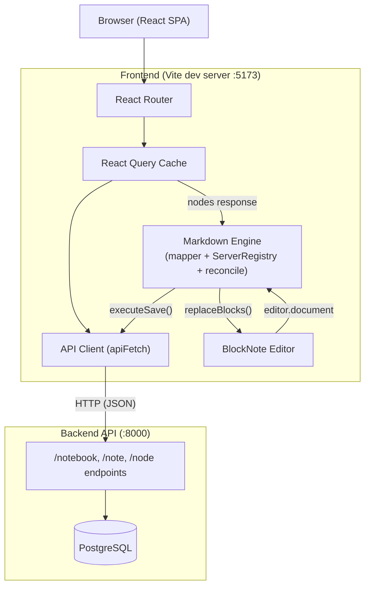
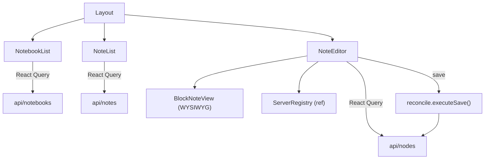

# Frontend Architecture

The frontend is a React single-page application that provides a notebook/note editing interface backed by the REST API. It is built with Vite, TypeScript, React Router, TanStack React Query, and **BlockNote** (WYSIWYG block editor).

## High-Level Overview


```mermaid
graph TB
    Browser["Browser (React SPA)"]

    subgraph Frontend["Frontend (Vite dev server :5173)"]
        Router["React Router"]
        RQ["React Query Cache"]
        API["API Client (apiFetch)"]
        BN["BlockNote Editor"]
        MD["Markdown Engine<br/>(mapper + ServerRegistry + reconcile)"]
    end

    subgraph Backend["Backend API (:8000)"]
        REST["/notebook, /note, /node endpoints"]
        DB[(PostgreSQL)]
    end

    Browser --> Router
    Router --> RQ
    RQ --> API
    API -- "HTTP (JSON)" --> REST
    REST --> DB

    BN -- "editor.document" --> MD
    MD -- "executeSave()" --> API
    RQ -- "nodes response" --> MD
    MD -- "replaceBlocks()" --> BN
```

The frontend runs as a Node/Vite dev server on port 5173 and communicates with the Python backend API on port 8000 over HTTP/JSON. All server state is managed through React Query; there is no client-side persistence.

## Provider Hierarchy

`main.tsx` first calls `initSentry(routes)` (`lib/sentry.ts`, see
[Observability](observability.md)), then builds a data router
(`Sentry.wrapCreateBrowserRouter(createBrowserRouter)(routes)`) from the route
table in `routes.tsx` and mounts it with `Sentry.reactErrorHandler()` on the
React root's error hooks:

```
StrictMode
  QueryClientProvider        -- React Query cache (refetchOnWindowFocus: false)
    RouterProvider           -- React Router v7 data router
      RootProviders          -- root layout route (components/RouteLayouts.tsx)
       ThemeProvider         -- resolves 'light' | 'dark' (see Theming)
        LayoutModeProvider   -- resolves 'mobile' | 'desktop' | 'tui' (see Responsive layout, TUI layout)
          Sentry.ErrorBoundary -- reports render errors, shows a reload fallback
            <public pages>
            ProtectedLayout  -- pathless layout route
              AuthProvider   -- GET /auth/me (sets the Sentry user); redirects to
                                /login without a session
                <protected pages>
```

The root route also has `errorElement: <RouteErrorElement />`, which reports
errors the data router catches itself (they never reach a React boundary).

A data router is required for `useBlocker` (the unsaved-changes guard).
Authentication is cookie based: `apiFetch` sends `credentials: 'include'`,
and `AuthProvider` exposes `{ user, logout }` via `useAuth()`. The access
cookie lives 5 minutes, so `AuthProvider` runs `useSessionHeartbeat`: while
the page is visible it calls `POST /auth/refresh` every 4 minutes, and right
away when a tab hidden for longer becomes visible again.

## Routing

Routes are declared in `src/routes.tsx`.

| Route | Page |
|---|---|
| `/login`, `/register` | `LoginPage`, `RegisterPage` (password + Google sign-in) — public |
| `/login/switch-to-google` | `SwitchToGooglePage`: confirm converting a password account to Google sign-in — public |
| `/invite/:inviteId` | `AcceptInvitePage` — public |
| `/confirm-email/:token` | `ConfirmEmailPage` — public |
| `/` | Redirects to `/notebooks` |
| `/notebooks` | `Layout`: notebook list |
| `/notebooks/:notebookId/notes` | `Layout`: notebook list + note list |
| `/notebooks/:notebookId/notes/:noteId` | `Layout`: lists + note editor |
| `/notebooks/:notebookId/notes/:noteId/window` | `NoteWindow`: the note editor alone, in its own browser window |
| `/invites` | `InvitesPage`: send, resend and void invites |
| `/settings` | `SettingsPage`: sign-in method; a Google user can switch to password after re-authenticating with Google |

The three note routes are siblings that render the same `<Layout />` element
at the same position, so React reuses one `Layout` (and `NoteEditor`)
instance while navigating between them (`routes.test.tsx` covers this).

## Responsive layout

The same SPA serves desktop, tablets and phones
([spec](../specs/0006-mobile-layout.md)).

- **Mode rule** (`layout/layoutMode.ts`): `mobile` iff viewport width
  `< 768px` or height `< 500px`, else `desktop`. Phones stay mobile in both
  orientations; tablets are desktop.
- **Override**: `?layout=mobile|desktop` on any URL forces the mode and
  persists it in `sessionStorage` (`assistant.layoutMode`); `?layout=auto`
  clears it.
- **Resolution** (`layout/LayoutModeContext.tsx`): `LayoutModeProvider`
  combines the override with a `matchMedia` subscription and exposes
  `useLayoutMode()` / `useIsMobile()`. Structural decisions (which panels
  render) are made in JS so they are testable in jsdom.
- **Styling**: the provider mirrors the mode on `<html data-layout="…">`;
  mobile CSS is scoped under `[data-layout="mobile"]` so the override affects
  styling too. Media queries are only used for sizing (e.g. the desktop
  sidebar and notes column narrow below 1024px). `.app-shell` uses `100dvh` and
  safe-area insets (`viewport-fit=cover`).
- **Single tree**: `Layout` renders one component tree in both modes — the
  header slot swaps between `DesktopHeader` and `MobileTopBar`, the sidebar
  and notes column are conditionally rendered, and `.main` keeps its position — so switching
  mode (resize, override) never remounts `NoteEditor` or loses unsaved edits.
- **Mobile navigation**: only the deepest URL level is shown (notebook list,
  note list, or editor) under a `[← back] [title] [⋯]` top bar. The back
  link goes one URL level up.
- **Top bar extension points** (provided by `Layout`):
  - `TopBarSlot.tsx`: `<TopBarActions>` portals children (NoteEditor's
    save state) into the top bar; renders nothing on desktop.
  - `TopBarMenuContext.tsx`: `useTopBarMenuItems(items)` adds entries
    (Share, Debug) to the `⋯` `OverflowMenu` while the caller is mounted.
- **Mobile editor**: save state in the top bar, save errors in a status line under it, Share/Debug
  in the `⋯` menu, debug view full screen, sticky horizontally scrolling
  formatting toolbar.
- **Editor scrolling**: on desktop the note editor fills `.main` and the
  BlockNote container (`.editor-content > .bn-container`) is the scroll
  area, so the formatting toolbar and the bottom bar stay visible. On mobile the
  editor grows with its content and `.main` scrolls instead.
- **Dialogs**: `.modal` (share dialog, confirmations) is full screen on
  mobile. Auth pages, `InvitesPage` and `SettingsPage` are responsive CSS
  only; `InvitesPage` and `SettingsPage` render `MobileTopBar` on mobile.
- **Tests**: `renderWithProviders(ui, { layout })` forces a mode
  (default `'desktop'`; `'auto'` uses real detection), and
  `test/matchMedia.ts` provides `mockViewport` / `resizeViewport`.

## TUI layout

A third layout mode, `tui`, draws the desktop columns as text-framed panes
in a monospace font, with a menu bar on top and a Midnight Commander style
function-key bar at the bottom. The viewport never selects it: it is turned
on with `?layout=tui` (the **TUI** link in `DesktopHeader`) and persisted
like the other overrides; `?layout=auto` (F10, or View → Classic layout)
turns it off. Code lives in `components/tui/`.

- **Same tree**: `Layout` always renders `TuiProvider` and keeps the
  `.sidebar` / `.notes-column` / `.main` slots; in TUI mode it swaps
  `NotebookList` / `NoteList` for `TuiNotebookPanel` / `TuiNotePanel`, adds a
  `TuiBorder` before `NoteEditor` and swaps the header for `TuiMenuBar`.
  Switching modes never remounts `NoteEditor`.
- **Frames** (`TuiBorder`): an overlay of box-drawing characters (double
  lines on the active pane) inside a `.tui-framed` parent that leaves one
  line / one character of padding. Edges are long character runs clipped by
  `overflow: hidden`, so frames follow any size. Colors use the theme tokens,
  so every theme works.
- **Panes**: `notebooks`, `notes` and `editor`, marked with `data-tui-pane`.
  `TuiProvider` tracks the active pane (it follows `focusin`) and moves DOM
  focus with `focus(target)`. List panes register a handle with
  `useTuiList(pane, { run })` and receive `ListCommand`s; the cursor
  (`listCursor.ts`) follows an item id and starts on the open item.
- **Keys** (`keys.ts`, pure and unit-tested): F1 Help, F2 Share, F3
  Hide/show notebooks, F4 Edit, F5 Tags, F6 Filter, F7 New, F8 Delete, F9
  Menu, F10 Classic. Alt+1…0 and Esc-then-digit are equivalents (laptops and
  browsers often eat F-keys). ↑/↓/PgUp/PgDn/Home/End move the cursor, Enter
  opens, Tab/Shift+Tab and ←/→ switch panes. While focus is in the editor or
  a text field, only F-keys, their equivalents and Esc (back to the list) are
  taken. The controller ignores keys while the menu, help or any
  `.modal-overlay` dialog is open; the key bar and menus also work with the
  mouse.
- **Dialogs**: new notebook / note and filter use `TuiPrompt`; share,
  confirm and import reuse the classic dialogs with a TUI skin.

## Theming

Both layouts support six themes: the neutral `light` and `dark`, plus four
color themes — `blossom` (pink + marine green, light base), `sand` (cream +
terracotta, light base), `ocean` (navy + cyan, dark base) and `twilight`
(violet + amber, dark base).

- **Preference** (`theme/theme.ts`): `'system'` or one of `THEMES`, stored in
  `localStorage` (`assistant.theme`; `'system'` clears the key). `'system'`
  follows `(prefers-color-scheme: dark)` and picks `light` or `dark`; an
  explicit choice wins. `colorSchemeOf(theme)` gives each theme's light/dark
  base.
- **Resolution** (`theme/ThemeContext.tsx`): `ThemeProvider` (outermost in
  `RootProviders`, so auth pages are themed too) subscribes to the OS color
  scheme via `matchMedia`, exposes `useTheme()` → `{ theme, colorScheme,
  preference, setPreference }` and mirrors the theme on
  `<html data-theme="…">`.
- **No flash**: an inline script in `index.html` applies the same rule
  before first paint; keep the two (including the theme list) in sync.
- **Styling**: every color in `index.css` is a CSS variable defined on
  `:root`. Dark-based themes share the `:root[data-theme="dark"]` block
  (which also sets `color-scheme`) and each theme then overrides its palette
  tokens under `:root[data-theme="<name>"]`. New styles must use the tokens,
  not literal colors. The header / mobile top bar stays dark in every theme
  (tinted by the color themes).
- **Adding a theme**: add it to `THEMES` and `COLOR_SCHEMES` in `theme.ts`,
  to the list in `index.html`, a label in `ThemeSwitcher.tsx`, and a token
  block in `index.css` (add dark-based ones to the shared dark selector).
- **Editor**: `BlockNoteView` receives `theme={colorScheme}`; its editor
  surface colors are mapped to the app tokens.
- **Controls**: `ThemeSwitcher.tsx` — a `<select aria-label="Theme">` in
  `DesktopHeader`, and `menuitemradio` entries in the mobile `⋯` menu (they
  keep the menu open).
- **Tests**: `setPrefersDark(dark)` in `test/matchMedia.ts` simulates the OS
  scheme. `test/setup.ts` installs an in-memory `localStorage` when the
  runtime's is unusable (Node ≥ 25 shadows jsdom's).

## Component Tree


```mermaid
graph TD
    Layout --> NotebookList
    Layout --> NoteList
    Layout --> NoteEditor

    NotebookList -- "React Query" --> API_Notebooks["api/notebooks"]
    NoteList -- "React Query" --> API_Notes["api/notes"]
    NoteEditor -- "React Query" --> API_Nodes["api/nodes"]
    NoteEditor --> BlockNoteView["BlockNoteView (WYSIWYG)"]
    NoteEditor --> ServerRegistry["ServerRegistry (ref)"]
    NoteEditor -- "save" --> Reconcile["reconcile.executeSave()"]
    Reconcile --> API_Nodes
```

### Layout

Top-level composition component (`components/Layout.tsx`). Reads `notebookId` and `noteId` from URL params. On desktop it renders a header plus three columns:
- **Sidebar** (`.sidebar`, 260px, 200px below 1024px): `NotebookList`, always visible.
- **Notes column** (`.notes-column`, 340px, 280px below 1024px): `NoteList`, shown when a notebook is selected.
- **Main area** (flex): `NoteEditor` when a note is selected; placeholder message otherwise.

A `«`/`»` button at the top of the notes column hides or shows the notebooks column while a notebook is open (`layout/useNotebooksHidden.ts`, remembered in `localStorage` as `assistant.notebooksHidden`). At `/notebooks` the column is always shown, and there is no toggle on mobile.

On mobile it shows one level at a time; see [Responsive layout](#responsive-layout).

### NotebookList

Lists the user's notebooks with create/delete support (`components/NotebookList.tsx`). Uses React Query to fetch and mutate notebooks. Clicking a notebook navigates to its notes route. The active notebook is highlighted based on the URL. Notebooks are sorted by name by the API and loaded page by page (see [Pagination](#pagination)).

It also opens `ImportDialog` (an "Import" button in its header on desktop, an "Import from Evernote" entry in the `⋯` menu on mobile). The dialog uploads an Evernote export zip with `XMLHttpRequest` for progress, runs the import, then shows the report with links to notes that were kept because the user edited them, and invalidates the notebooks and notes queries.

### NoteList

Lists notes within the selected notebook (`components/NoteList.tsx`). Same CRUD pattern as NotebookList. Returns `null` when no notebook is selected. Its heading is the notebook name (`['notebook', id]` query, shared with the mobile top bar title).

Notes are sorted most recently updated first by the API and loaded page by page (see [Pagination](#pagination)). Each row is a card: last-update date (`formatNoteDate`: "May 11", with the year when it isn't the current one), title, and a two-line clamp of `Note.preview` (a plain-text excerpt the API builds from the note's first blocks). Share/delete buttons appear on hover on desktop. After each save `NoteEditor` invalidates `['notes', notebookId]`, so the edited note moves to the top with a fresh preview.

Each row shows the caller's tags on the note as read-only chips under the title (at most three, then a `+N` chip whose tooltip lists the rest), from `Note.tags` in the list response.

### Note window

On desktop the editor toolbar has an **Open in new window** button (`lib/noteWindow.ts`). The click opens a blank popup named `note-<noteId>` right away, because popup blockers only allow `window.open` inside the click. Reopening the same note reuses that window. The editor then flushes pending edits. If the save works, it points the popup at `/notebooks/:notebookId/notes/:noteId/window` and moves the main window back to the note list, so the note isn't open for editing in two places. If the save fails, it closes the popup and stays put.

`NoteWindow` (`pages/NoteWindow.tsx`) renders `<NoteEditor standalone />` (no pop-out button) under a slim title bar, or `MobileTopBar` without a back link in mobile mode, and sets `document.title` to the note title. It sits under `ProtectedLayout`, so it shares the main window's cookie session.

### Pagination

`NotebookList` and `NoteList` use `useInfiniteQuery` over the offset-paginated list endpoints, `PAGE_SIZE` (50, `api/pagination.ts`) items per request; `nextPageOffset` stops when a page comes back short. The query keys stay `['notebooks']` and `['notes', notebookId]`, so existing invalidations refetch every loaded page.

Infinite scroll (`hooks/useInfiniteScroll.ts`) watches a sentinel `<li>` at the end of the list with an `IntersectionObserver` (200px margin). The sentinel is rendered only while there is a next page and none is loading: every fetch remounts it, and a sentinel that is still visible (a list shorter than the screen) fires again right away. Tests drive it with the fake in `test/intersectionObserver.ts`.

Both lists gate share/delete actions on the item's `permissions`, open `ShareDialog` to manage entitlements, and ask for confirmation (`ConfirmDialog`) before deleting.

### NoteEditor

The main editing surface (`components/NoteEditor.tsx`). Uses BlockNote (`useCreateBlockNote`) to create a WYSIWYG block editor that replaces the old textarea. Key responsibilities:

1. **Load**: Fetches `NoteNode[]` from the server via React Query. Calls `buildBlocksFromNodes()` to convert server nodes into BlockNote blocks and populate `ServerRegistry`. Calls `editor.replaceBlocks()` to set the document, then snapshots the initial serialized state.
2. **Edit**: The `BlockNoteView` component provides a rich WYSIWYG editing experience with a built-in formatting toolbar (bold, italic, headings, lists, code, tables, text colors, etc.). Changes are tracked via `editor.onChange()` to set the dirty flag.
3. **Auto-save**: there is no Save button. `useAutoSave` (`hooks/`) starts a timer on the first edit after a save and, after `VITE_AUTOSAVE_SECONDS` (default 5), calls `executeSave()` once for everything edited in that window. Edits made while a save is in flight are saved in the next window. A failed save keeps the edits dirty and retries on the next edit; a 409 conflict stops auto-saving until the note is reloaded. After a save the `['nodes', …]` query is only marked stale (`refetchType: 'none'`): refetching would replace the blocks under the cursor. The save state (`Saved` / `Unsaved changes` / `Saving…` / `Not saved`) shows in the bottom bar (desktop) or the top bar (mobile); it is hidden on read-only notes.
4. **Toolbar and attachments**: `MarkdownToolbar` applies block types/styles, indents/unindents list items (`nestBlock`/`unnestBlock`, same as Tab/Shift+Tab; the nested item is saved inside its parent block's markdown) and uploads files as attachment nodes, listed by `AttachmentList` below the body.
5. **Tags**: `TagEditor` (between the toolbar and the body, both layouts) shows the caller's tags on the note as removable chips and an "Add tag" combobox. Suggestions come from `GET /tag` (query key `['tags']`), filtered case-insensitively and excluding tags already on the note; an unmatched name offers `Create "<name>"`, which tags the note by name so the backend creates the tag. Arrow keys/Enter/Escape drive the list. Tagging needs only `view_note`, so it works on read-only notes. On success it writes the returned tags into the `['note', nb, note]` cache and invalidates `['notes', nb]` (and `['tags']` after a create). Tags are saved immediately, independent of auto-save.
6. **Unsaved-changes guard**: `useUnsavedChangesGuard(isDirty, flush)` (`hooks/`) uses `useBlocker` to intercept pathname-changing navigations (links, the mobile back arrow, browser back/swipe) while edits are pending. It saves them first (`flush`) and proceeds; only if that save fails does it ask "Discard unsaved changes?". It also registers a `beforeunload` prompt while dirty. Query-string-only changes (e.g. `?layout=`) are not blocked.

Holds a `ServerRegistry` and a block snapshot in refs that persist across renders. Save state (`isDirty`, `saving`, `error`) comes from `useAutoSave`; only where the controls render differs between layouts.

## Markdown Engine

The `src/markdown/` module is the core data layer of the editor. Three files work together to bridge BlockNote's document model with the server's node-per-block API.

### ServerRegistry (`markdown/serverRegistry.ts`)

A side table that maps **BlockNote block IDs → server node state** (`nodeId`, `version`, `nodeType`). This is the block identity invariant: every BlockNote block that has a corresponding server node is registered here.

Key operations:
- `set(blockId, state)` — registers a block's server identity on load or after create.
- `get(blockId)` — looks up server state for a given block.
- `markDeleted(blockId)` — moves the block's server node ID to the deleted queue.
- `consumeDeletedIds()` — drains the deleted queue (used by the reconciler before DELETE calls).
- `updateVersion(blockId, version)` — updates the version after a successful PATCH.
- `clear()` — resets the registry on note change.

### Mapper (`markdown/mapper.ts`)

Converts `NoteNode[]` from the API into BlockNote blocks and populates the `ServerRegistry`.

- `buildBlocksFromNodes(nodes, editor, registry)` — for each server node, calls `editor.tryParseMarkdownToBlocks(node.payload)` to parse markdown into block(s). The first parsed block is the primary block and gets registered against the server node ID. If a node payload parses into multiple blocks, extra blocks are appended but are flagged for creation on the next save.
- `buildSnapshot(blocks, editor)` — serializes the current block array into a `Map<blockId, string>` used by the reconciler to detect content changes.

### Reconcile (`markdown/reconcile.ts`)

The sync engine that persists changes to the server. `executeSave()` runs these phases:

1. **Detect deleted blocks** — blocks present in the previous snapshot but absent from `editor.document` are marked deleted in the registry.
2. **Delete server nodes** — drains `registry.consumeDeletedIds()` and issues `DELETE` calls.
3. **Create / migrate / update blocks** — iterates `editor.document` in order:
   - New blocks (no registry entry): `CREATE` with `afterNodeId`/`beforeNodeId` positional hints.
   - Legacy `text` nodes: delete old node, re-create as `markdown`.
   - Changed blocks (registry entry exists, content differs from snapshot): `PATCH` with `expected_version`.
4. **Return new snapshot** — serialized state of the saved document, used as the baseline for the next save.

## API Layer

All API modules live in `src/api/` and use a shared `apiFetch()` wrapper (`api/client.ts`) that:
- Reads `VITE_API_BASE_URL` (defaults to `http://localhost:8000`)
- Sets `Content-Type: application/json` when there is a body and sends cookies (`credentials: 'include'`)
- Throws `ApiError` (with HTTP status) on non-OK responses

Modules: `auth.ts`, `users.ts`, `notebooks.ts`, `notes.ts`, `nodes.ts`, `files.ts`, `invites.ts`, `imports.ts`, `tags.ts`.

## Data Flow Summary

```
Load:  NoteNode[] --> buildBlocksFromNodes() --> editor.replaceBlocks() --> BlockNoteView
                  ↳ ServerRegistry populated   ↳ snapshot captured

Edit:  User types / formats --> BlockNote internal state --> editor.onChange → isDirty=true

Save:  executeSave() --> diff snapshot vs editor.document
                     --> DELETE/CREATE/PATCH API calls
                     --> registry updated, new snapshot returned
```
