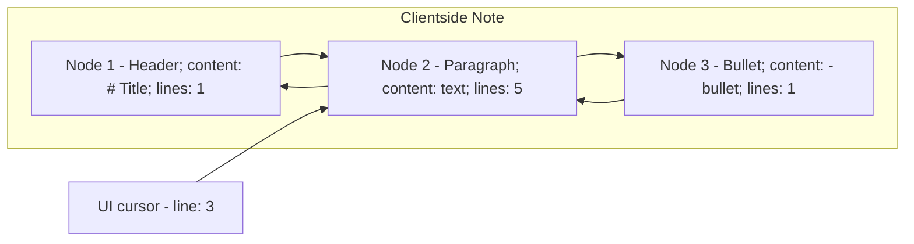

# Markdown Support

We support multiple notes format. At this point we support Markdown
only. This document describes the architecture of the Markdown
support.

## Overall architecture

We store notes through a sequence of nodes - [`Notes Service`](../architecture/notesservice.md). We are going to leverage Nodes to identify markdown blocks.

This will allow us to permit concurrent modifications. This means we represent
the Note with a Node per block and that the client must be aware of a nodes
data structure so it can decide which nodes to update and where to insert a Node.

## Matkdown blocks

These are the blocks that we model as nodes:

- Headings (all of them and in both the single line and multiline form)

- Paragraph. Each paragraph is a Node. Emphasis does not breal the paragraph node.
  Links are not breaking Node.

- Blockquotes. Nested quotes do not break the Node. Same is true for sub blocks
  in a Blockquote

- Each element of a list is a Node

- Images

- Code blocks (each block is a Node)

## Data model

We have a Markdown Node type in `NodeType` enum. The Markdown node contains
information on the node type: paragraph, header, etc. The text in the node
is the markdown content of the block.

This means that we can concatenate the The payloads of all the nodes adding
a newline between each nodes and we have a renderable version of the document.

The client has an in memory data structure to represent the document that
reflects the one in the server and allows us to map a line number in the
textbox to the node so we can tell where to add a Node or which one to update.

The client data structure is a sequence of blocks. Each block corresponds to a
node and contains the Markdown content. This sequence is modeled as a doubly
linked list and also contains information on the number of lines the node
contains.

Each client node contains the number of lines the block contains. The UI code
keeps a reference between the cursor position (the line number) and the Node.

- If a user types enter to create a new block, the block is added in the linked
  list in the right place.

- When the cursor moves we scan the list and update the reference to the right
  node.

When we save the node it is easier to compute the updates we did to the linked
list and turn them into calls to the api that adds, delete and updates nodes.
