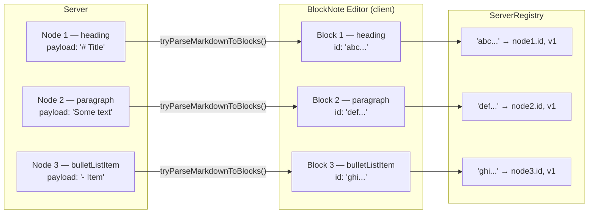

# Markdown Support

Notes are stored and rendered as markdown. The web UI provides a WYSIWYG editing experience via **BlockNote**, which renders and formats markdown inline. The backend stores note content as text (one block per API node); the markdown structure is entirely managed on the client side.

## Overall Architecture

Notes are stored as sequences of API nodes — see [`Notes Service`](../architecture/notesservice.md). Each node holds the markdown payload of one block. This one-block-per-node design enables future concurrent modifications: independent block edits can be reconciled without full-document conflicts.

The WYSIWYG editor uses **BlockNote** (`@blocknote/core`, `@blocknote/react`, `@blocknote/mantine`) as its document model and rendering layer. BlockNote provides block-level editing, an inline formatting toolbar, and built-in support for colors, tables, code blocks, lists, and headings.

## Block Identity

The critical invariant is a strict 1:1 mapping between **BlockNote blocks** and **server nodes**:

```
Server Node ←→ BlockNote Block
  id              registry entry: { nodeId }
  version         registry entry: { version }
  block_type      block.type (BlockNote's native type string)
  payload         blocksToMarkdownLossy([block]).trim()
```

BlockNote assigns each block a stable UUID (`block.id`). The `ServerRegistry` side table maps these UUIDs to server node state. This enables the reconciler to issue targeted `CREATE`, `PATCH`, and `DELETE` calls without scanning the full document.

## Supported Block Types

BlockNote's default schema provides these block types (stored as the `block_type` field on server nodes):

| BlockNote type       | Rendered as             |
|----------------------|-------------------------|
| `paragraph`          | `<p>` text              |
| `heading`            | `<h1>`–`<h6>`           |
| `bulletListItem`     | `<ul>` item             |
| `numberedListItem`   | `<ol>` item             |
| `checkListItem`      | Checkbox list item      |
| `codeBlock`          | Fenced code block       |
| `table`              | HTML table              |
| `quote`              | Blockquote              |
| `image`              | Inline image            |

Inline content (bold, italic, underline, strikethrough, code, links, text color, background color) is handled within blocks by BlockNote.

## Color Support

Text and background colors are supported via BlockNote's built-in formatting toolbar. Colors are applied as CSS classes in the WYSIWYG view.

**Serialization limitation**: When blocks are serialized to markdown for server storage with `blocksToMarkdownLossy()`, color annotations are not preserved. Colors are a UI-only feature in the web client and will be lost after a save/reload cycle. Other clients (e.g., the TUI) reading the raw payload will see uncolored text.

## Data Flow



## Reconciliation

On save, the reconciler diffs `editor.document` against a snapshot taken at the last successful save:

- **Deleted blocks** (in snapshot, not in current document): server node is `DELETE`d.
- **New blocks** (in current document, not in registry): server node is `CREATE`d with positional hints (`afterNodeId`, `beforeNodeId`) to maintain ordering.
- **Changed blocks** (in registry, content differs from snapshot): server node is `PATCH`ed with the new payload and `expected_version` for optimistic concurrency control.

See [`reconcile.ts`](../../frontend/src/markdown/reconcile.ts) and [`serverRegistry.ts`](../../frontend/src/markdown/serverRegistry.ts) for implementation details.
