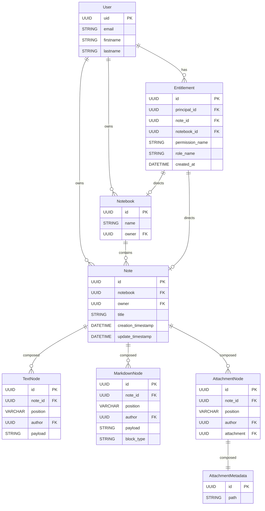

# The Notes Service

This is the system that manages the Notes data model.

- It includes the Postgres tables and the SQLAlchemy models
- It includes a series of modules that support these operations: CRUD for
  the note and the notebook; Concurrent edit of a note; provides the
  attachments.
- It manages ownership and role based access to notes and notebooks.
- Provides markdown formatted notes.

## Data Model

These are the postgres tabes



- User represents a user in the system
- A User has Notebooks and a Notebook contains Notes
- A Note is composed by a sequence of Nodes, each Node represents some content
  and there can be multiple types: TextNode, AttachmentNode.
- Nodes represents a sorted list (by position), though we can insert Nodes
  in between existing ones and we can break or merge nodes. The position
  uses fractional indexing (a VARCHAR that sorts lexicographically), which
  allows unlimited insertions between any two positions.
- Notes, Nodes and Notebooks have an owner.
- There is an RBAC system to manage access to Notes and Notebooks — see
  Access Control below.

## Structure of a Note.

The data structure of a Note is a list of Nodes. A Node represent a chunk
of the note, whatever the format would be. This sequence has a few logical
operations:

- Add a Node at the end
- Insert a Node in a specific place in the list.
- Split a node into preserving the sequence
- Merge two nodes preserving the sequence
- Delete a Node.

### Node Ordering: Fractional Indexing

Nodes are ordered by a `position` column (VARCHAR) using **fractional indexing**.
Positions are short lexicographically sortable strings. Between any two
positions, a new position can always be generated by extending the string.

This approach is used by Figma and Linear. It provides unlimited precision
(unlike DECIMAL or float, which exhaust precision after repeated subdivision)
and requires no rebalancing.

Example:

```
Note 1:
- Node 1: position: "a0" payload: This is a paragraph
- Node 2: position: "a1" payload: This is the second paragraph
- Node 3: position: "a2" payload: This is the third paragraph
```

When splitting Node 2 we generate a position between "a1" and "a2":

```
Note 1:
- Node 1: position: "a0" payload: This is a paragraph
- Node 2: position: "a1" payload: This is the
- Node 4: position: "a1V" payload: second paragraph modified
- Node 3: position: "a2" payload: This is the third paragraph
```

We can keep inserting between any two positions indefinitely:

```
Between "a1" and "a1V" → "a1G"
Between "a1G" and "a1V" → "a1K"
```

The positions sort lexicographically, so retrieving a note's content is a
single query: `SELECT * FROM nodes WHERE note_id = ? ORDER BY position`.

When merging two adjacent nodes, one node absorbs the other's content and
the absorbed node is deleted. The surviving node keeps its position.

### Position Generation

Positions are generated **server-side**. This eliminates the risk of two
clients generating the same position for concurrent inserts — the server
sees the current state and always produces a unique key.

## Concurrent Editing

Notes can be shared between users who may edit them concurrently. The
node-based structure reduces the conflict surface: two users editing
different nodes in the same note do not conflict.

For same-node conflicts, V1 uses **optimistic locking** at the node level.

### How It Works

Every Node has a `version` integer, starting at 1. When a client updates
a node, it sends the version it read:

```sql
UPDATE nodes
SET payload = ?, version = version + 1
WHERE id = ? AND version = ?
```

If 0 rows are affected, another user modified this node in the meantime.
The server returns a conflict error with the current node state, and the
client surfaces the conflict so the user can re-apply their edit.

### Conflict Scenarios

| Scenario | Outcome |
|---|---|
| Two users edit different nodes | No conflict — independent row updates |
| Two users edit the same node | Detected via version mismatch; second writer gets conflict error |
| One user splits a node another is editing | Detected via version change on the split node |
| Two users insert at the same position | No conflict — server generates unique positions |
| Two users delete the same node | Idempotent — deleting an already-deleted node is a no-op |

### Limitations (acceptable for V1)

This strategy does not support real-time keystroke-level collaboration
(like Google Docs) or automatic merging of concurrent text edits within
a single node.

**Upgrade path:** If real-time co-editing becomes a priority, adopt CRDTs
(e.g., Yjs) at the node payload level. The node structure and position
system remain unchanged — only the intra-node text representation changes.

## Access Control

Notes and Notebooks have an `owner_id` (kept as a denormalized/display
field) plus a full RBAC system for sharing with other users, implemented in
`src/assistant/notes/permissions.py` (read side: effective-permission
computation and `require_*_access` guards) and
`src/assistant/notes/entitlements.py` (write side: grant/revoke/list). See
`docs/specs/0003_role_based_access_control.md` for the full permission
catalog, role definitions, and evaluation rules.

### How It Works

Permissions and roles are Python enums (`PermissionName`, `RoleName` in
`src/assistant/models/schema.py`) with no backing database table — the
`ROLE_PERMISSIONS` mapping in `permissions.py` is the single source of
truth for role → permission expansion. An `Entitlement` row grants one
principal (always an individual `User`) either a single permission or a
whole role on exactly one subject (a Note or a Notebook), enforced by
`CheckConstraint`s mirroring the `Node.node_type` discriminator pattern.
Entitlements are additive only — revoking access deletes the row.

Creating a Notebook or Note auto-grants its creator an owner entitlement
(`notebook_owner`/`note_owner`) in the same transaction as the subject's own
insert, so a row is never left without an owner.

Every function in `notes/service.py` that touches an existing Notebook/Note
takes a `caller_id` and enforces permissions itself via `permissions.py` —
authorization is not just an API-layer concern. A caller who cannot even
view a subject gets a 404-shaped not-found error; a caller who can view it
but lacks the specific permission for the action gets a `PermissionDeniedError`
(403). Sharing (`grant_entitlement`/`revoke_entitlement`) is itself gated by
`share_note`/`share_notebook` and bounded by the granter's own current
permission level — nobody can grant more access than they themselves have.

### Notebook Visibility

A notebook is visible to a user either via a direct notebook-level
entitlement, or because the user holds any entitlement on at least one note
inside it (`can_view_notebook`) — sharing a single note surfaces its parent
notebook without granting any notebook-level permission.

## Notes Service

The Notes service is a python module (`/src/assistant/notes`). It exposes
the functions above. The SQLAlchemy models are in `src/assistant/models`.

The module exposes these functions:

- create_notebook
- delete_notebook
- list_notebooks
- get_notebook

The Notebook class can return the list of Notes.

The Note class allows access to the nodes and exposes the functions above:

- Add a Node at the end
- Insert a Node in a specific place in the list.
- Split a node into preserving the sequence
- Merge two nodes preserving the sequence
- Delete a Node.


## Infrastructure

- This is a simple service with no framework. We will run it in a FastAPI
  api described in another doc.
- We use a postgres database. We run it locally in a container.
- We use SQLAlchemy https://pypi.org/project/SQLAlchemy/ as an ORM to deal with the database.
