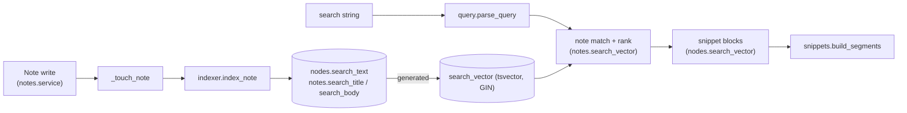

# Search

Keyword and tag search over notes. Product behaviour is in
[`docs/specs/0007-search.md`](../specs/0007-search.md). Why we use Postgres
full-text search rather than BM25 or a search library is in
[`ADR-0002`](../adr/0002-postgres-fts-search.md).

The code lives in `src/assistant/search/`. Its single public entry point is
`search.service.search(session, caller, raw_query, *, offset, limit, sort)`.
The API, and later the agent and the TUI, depend only on it, so the engine
behind it can change without touching callers.

## Pipeline

1. **Analysis** (`analysis.py`): NFKD normalization, then strip combining
   marks (accent folding), casefold, and split on `\w+`. There is no
   stemming. `markdown_to_plain` turns a block's markdown into readable text
   (via `markdown-it-py`): it drops syntax, URLs and HTML, and keeps link
   text, image alt text and code. Changing either function means bumping
   `SEARCH_INDEX_VERSION`.
2. **Indexing** (`indexer.py`): `index_note` runs in the same transaction
   as every note write. It is called from `notes.service._touch_note`,
   which every mutation goes through, and from `create_note`. It writes the
   analyzed tokens joined by spaces: `nodes.search_text` for each block, and
   `notes.search_title` / `notes.search_body` for the note. It also stamps
   `notes.search_index_version`. Postgres derives the generated
   `search_vector` columns with the `simple` config; the note vector gives
   the title weight A and the body weight B. Because tokenization already
   happened in Python, Postgres only ever sees clean words, and indexing and
   querying can't disagree.
3. **Parsing** (`query.py`): `parse_query` turns the string into a
   `SearchQuery`: terms, phrases, tag keys, and a prefix. The last bare word
   is a prefix when the string doesn't end in whitespace and the word has at
   least 2 characters. `to_tsquery` ANDs all of these, and every lexeme is
   quoted. `to_any_word_tsquery` ORs them to pick snippet blocks. An empty
   query raises `EmptySearchQueryError`.
4. **Matching** (`service.py`):
   - **Visibility**: `permissions.viewable_note_filter(caller)` is the
     set-based counterpart of `require_note_access(..., VIEW_NOTE)`.
   - **Tags**: one `EXISTS` per `tag:` filter, using the caller's own tags.
     If the caller doesn't have a named tag, the result is empty and the
     tag is listed in `unknown_tags`.
   - **Text**: `notes.search_vector @@ to_tsquery(...)`.
   - **Order**: `ts_rank_cd`, then `update_timestamp`. A query with only tags
     is ordered by `update_timestamp` alone.
5. **Snippets** (`service._snippets`, `snippets.py`): for the page's notes,
   the up to 3 best-ranked blocks that match any query word, shown in note
   order. A note with no matching block shows its first non-empty block. The
   snippet text is cut to about 160 characters around the first match, on
   word boundaries. Highlighting happens in Python, by matching folded
   tokens against the original text, and comes back as `SnippetSegment`s,
   never HTML.

## Postgres-only columns

The `search_vector` columns and their GIN indexes are created in the
`add search index` migration and deliberately left out of the ORM: tests run
on SQLite, which has no `tsvector`. Raw references go through
`literal_column` in `service.py`. `include_object_for_migrations` tells
Alembic autogenerate to ignore them.

Tests that need them use the `pg_session` fixture and the `postgres`
pytest marker. They skip when Postgres is unreachable (see
[`docs/devenv.md`](../devenv.md)).

## Operations

- After the migration, and after any bump of `SEARCH_INDEX_VERSION`, run
  `make reindex-search` (`python -m assistant.cli.reindex_search
  --stale-only`). Pass `--user-id` to reindex a single user's notes.
- The API is `GET /search/notes`, documented in [`api.md`](api.md). It sits
  under `/search/` so that the SPA's `/search` page isn't proxied to the
  backend (see `docker/frontend/nginx.conf.template`).

## Future work

- **BM25**: `pg_textsearch` (needs PG 17+), or our own postings tables. This
  changes only the match/rank step in `service.py`.
- **Vector or hybrid search**: merge PGVector results inside `search()`.
- **Async indexing**: replace the body of `index_note` with an outbox insert.
