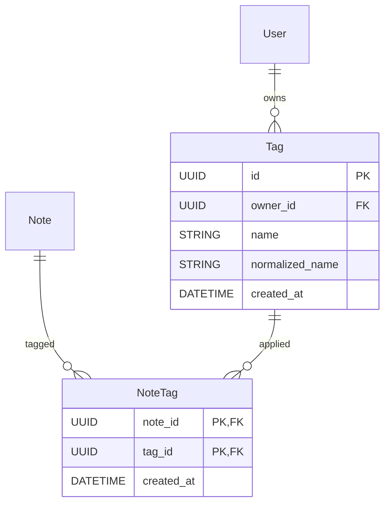

# Implementation plan: Note tags

Adds a per-user tag vocabulary and an m:n link between notes and tags.
Users can tag and untag notes, create tags (including on the fly while
tagging), and a share copies the sharer's tags on the shared note(s) into
the recipient's vocabulary.

## Context

- There is no `Account` entity. A `User` is the account, so tags are scoped
  per user (`owner_id → assistant.users.uid`).
- Schema changes go through Alembic (`alembic/versions/`, baseline
  `f27627e16644`). Tests build the schema with `Base.metadata.create_all()`
  on SQLite (`tests/conftest.py`), so models must stay SQLite-compatible.
- Sharing is done only through `grant_entitlement`
  (`src/assistant/notes/entitlements.py:83`). Its only callers are the share
  endpoints in `api/routes/notes.py:172` and `api/routes/notebooks.py:117`.
  Invites don't create entitlements, so there's no other path to hook.
- `NoteResponse` (`api/schemas/notes.py`) is built per caller by
  `_note_response` (`api/routes/notes.py:49`) because it already carries
  per-caller `permissions`. Per-user tags fit the same pattern.

## Decisions

- **Account = User.** Each user has their own tag list.
- **Tags on a note are per user.** `note_tags` links a note to tags, and each
  user sees only the links to their *own* tags. Two collaborators on one note
  can tag it differently. A tag is personal organization, so tagging needs
  only `view_note` on the note, not `update`.
- **Share propagation (snapshot).** When a grant creates a *new* entitlement
  (`created=True`), the **granter's** tags on each affected note are copied
  to the grantee: the grantee's tag with the same name is matched, or created
  if missing, and then linked to the note. A note share copies one note. A
  notebook share copies every note in the notebook at grant time. Notes added
  to the notebook later get nothing. An idempotent re-share copies nothing,
  so a tag the recipient removed on purpose doesn't come back.
- **Name matching is case-insensitive and trimmed.** The display `name` is
  stored trimmed and keeps the casing it was first created with. A
  `normalized_name` (`name.strip().casefold()`) column carries the
  uniqueness constraint. A plain column, not a functional index, so it works
  identically on SQLite and Postgres. Length 1–64 after trimming, otherwise
  422.
- **Revoking a share does not delete the recipient's tag links.** They become
  invisible because every read goes through note access checks, and they
  come back if the note is re-shared. Any future "notes by tag" query must
  filter by note access.
- **Out of scope** (possible follow-ups): renaming or deleting tags, filtering
  or searching notes by tag, importing Evernote tags, using tags in the
  RAG agent.

## 1. Data model (`src/assistant/models/schema.py`)

- `Tag` (`assistant.tags`): `id`, `owner_id` FK users (not null, indexed),
  `name String(64)`, `normalized_name String(64)`, `created_at`.
  `UniqueConstraint("owner_id", "normalized_name", name="uq_tag_owner_name")`.
- `NoteTag` (`assistant.note_tags`): composite PK `(note_id, tag_id)`, which
  makes a note's tags a unique set. FKs to `notes.id` and `tags.id` with
  `ondelete="CASCADE"`, plus `created_at`. Add an index on `tag_id` for
  future by-tag lookups.
- Relationships: `User.tags` (cascade delete-orphan), `Tag.note_links`
  (cascade delete-orphan), and `Note.tag_links` (cascade delete-orphan) so
  ORM deletes of notes and users clean up the links, matching how `files` and
  `entitlements` are handled today.
- Invariant (enforced in the service layer, not the DB): a `NoteTag` links a
  tag only to a note the tag's owner can view.

## 2. Migration

`alembic revision --autogenerate -m "add tags"` against a database at head,
then review it by hand: two `create_table`s, the unique constraint, the
`tag_id` index and the cascade FKs, with a matching `downgrade`. Verify with
`alembic upgrade head` and `downgrade -1` against the dev Postgres
(`make services-up`).

## 3. Service layer: new `src/assistant/notes/tags.py`

Follows the `entitlements.py` conventions: takes a `Session` plus the acting
`User`, flushes but never commits, and raises domain exceptions from
`notes/exceptions.py`.

- `normalize_tag_name(name) -> tuple[str, str]`: returns (trimmed display
  name, normalized key). Raises `InvalidTagNameError` (new) when empty or
  too long.
- `list_tags(session, owner) -> list[Tag]`: ordered by `name`.
- `find_or_create_tag(session, owner, name) -> tuple[Tag, bool]`: idempotent
  by normalized name. A concurrent insert race on `uq_tag_owner_name` is
  handled inside a `session.begin_nested()` savepoint: on `IntegrityError`,
  re-select the existing row.
- `get_tag(session, owner, tag_id) -> Tag`: raises `TagNotFoundError` (new)
  if the tag is missing or belongs to another user. Never leaks other users'
  tags.
- `add_tag_to_note(session, caller, note_id, *, tag_id=None, name=None) -> Tag`:
  exactly one of `tag_id`/`name`. `require_note_access(..., VIEW_NOTE)`.
  `name` goes through `find_or_create_tag`, which is how tags get created on
  the fly. Inserting an existing link is a no-op.
- `remove_tag_from_note(session, caller, note_id, tag_id) -> None`: needs
  `view_note`. Idempotent. Doesn't delete the tag itself.
- `tags_for_notes(session, caller, note_ids) -> dict[UUID, list[Tag]]`: one
  query (join `note_tags`→`tags` where `tags.owner_id == caller.uid`), used
  by list endpoints to avoid N+1.
- `copy_note_tags(session, *, source, target, note_ids) -> None`: for each
  note, takes the `source` user's tags on it, runs `find_or_create_tag(target,
  tag.name)` (resolved once per distinct name), and links each result to the
  note, skipping existing links.

**Hook into sharing** (`entitlements.grant_entitlement`): after a new
`Entitlement` is flushed, call `copy_note_tags(source=granter,
target=grantee, note_ids=…)`. For a note share that's `[note_id]`. For a
notebook share it's all note ids in the notebook, selected by
`Note.notebook_id`. Everything runs in the same transaction as the grant,
so a failure rolls back both. Update the docstring.

Export `tags` functions in `notes/__init__.py` if that module re-exports
service functions (check while implementing).

## 4. API

New `api/schemas/tags.py`:

- `TagResponse { id, name }`
- `TagCreate { name: str }`
- `NoteTagAdd { tag_id: UUID | None, name: str | None }` with a model
  validator that requires exactly one of the two.

`NoteResponse` gains `tags: list[TagResponse]` (the caller's tags only).
`_note_response` takes an optional pre-fetched tag list. `list_notes_endpoint`
calls `tags_for_notes` once for the page, and the single-note endpoints call
it with one id.

New `api/routes/tags.py`, registered in `api/app.py`:

| Method | Path | Behaviour |
|---|---|---|
| `GET` | `/tag` | Caller's tag vocabulary (used for autocomplete) |
| `POST` | `/tag` | Create a tag. Returns 201 if new, 200 with the existing tag if the normalized name already exists |
| `POST` | `/notebook/{nb}/note/{note}/tag` | Body `NoteTagAdd`. Adds an existing tag or creates one by name. Returns the note's updated `list[TagResponse]` |
| `DELETE` | `/notebook/{nb}/note/{note}/tag/{tag_id}` | Untag. 204 |

The note-scoped routes live in `routes/notes.py` next to the share routes
and reuse `_get_note_in_notebook` to validate the notebook. Map
`InvalidTagNameError` to 422 and `TagNotFoundError` to 404 in
`api/exceptions.py`, following the existing handlers. Route handlers only
call service functions, per the API-layer convention in AGENTS.md.

Add `list-tags`, `create-tag`, `tag-note` and `untag-note` subcommands to
`cli/api_client.py` so the API can be exercised by hand, and add them to the
AGENTS.md command list.

## 5. Frontend

- `types/index.ts`: `interface Tag { id: string; name: string }` and
  `Note.tags: Tag[]`.
- `api/tags.ts`: `fetchTags()`, `createTag(name)`, `addNoteTag(nb, note,
  {tagId} | {name})`, `removeNoteTag(nb, note, tagId)`.
- New `components/TagEditor.tsx`, shown in `NoteEditor` between the toolbar
  and the content on both desktop and mobile:
  - The current tags render as chips, each with an `×` remove button.
  - An "Add tag" text input opens a dropdown of the caller's tags that match
    the typed text (case-insensitive) and aren't already on the note.
  - Enter or click on a suggestion links that tag. If nothing matches
    exactly, the last option is `Create "<text>"`, which posts `{name}` and
    creates the tag on the fly. Escape closes the dropdown, and arrow keys
    move through suggestions. Matching is case-insensitive and trimmed, like
    the backend.
  - On success, invalidate `['tags']` plus the note and note-list queries,
    using the keys `Layout`/`NoteList` already use (confirm while
    implementing).
- `NoteList.tsx`: read-only tag chips under each note title, compact and
  truncated with a `+N` overflow so the list stays dense on mobile.
- CSS for the chips and dropdown in the existing stylesheet, following the
  mobile layout rules (`docs/specs/0006-mobile-layout.md`).

## 6. Tests

Backend, as module-level functions:

- `tests/notes/test_tags.py`:
  - normalization: trim, casefold, empty and too-long names.
  - `find_or_create_tag` is idempotent, case-insensitively.
  - per-user isolation: the same name for two users gives two rows, and one
    user can't see or use another user's tag ids.
  - add/remove is idempotent.
  - a viewer-only user can tag, and a user with no access gets not-found.
  - `tags_for_notes` returns only the caller's tags.
  - deleting a note removes its links.
- `tests/notes/test_entitlements.py`:
  - a note share creates any missing recipient tags and links them.
  - a note share reuses an existing recipient tag with a different case.
  - a notebook share propagates tags for all notes in the notebook.
  - an idempotent re-share doesn't re-add a tag the recipient removed.
  - the sharer's tags are untouched.
- `tests/api/test_tags.py`:
  - endpoint status codes: 201/200, 404 and 422.
  - `NoteResponse.tags` appears on get and list, and is per caller.

Frontend:

- `components/TagEditor.test.tsx`:
  - suggestions filter as the user types.
  - selecting a suggestion calls `addNoteTag` with the tag id.
  - typing a new name and pressing Enter calls it with `name`.
  - clicking `×` removes the tag.
  - an existing tag isn't suggested twice.
- `NoteList.test.tsx`: tag chips render.

Run `make check`, `make frontend-check` and `make frontend-test`.

## 7. Docs

- `docs/architecture/notesservice.md`: add `Tag`/`NoteTag` to the ER diagram
  and a short "Tags" section covering per-user scope, matching rules and
  share propagation.
- `docs/architecture/api.md`: the new endpoints.
- `docs/architecture/frontend.md`: `TagEditor`.
- `CONTEXT.md`: add **Tag** to the glossary if it keeps one.

## Implementation order

1. Model, migration and `notes/tags.py` with unit tests.
2. Share hook in `grant_entitlement` with its tests.
3. API schemas, routes, error mapping, CLI client and API tests.
4. Frontend types, API client, `TagEditor`, `NoteList` chips and tests.
5. Docs, then `make check` and `make frontend-check`/`frontend-test`.
